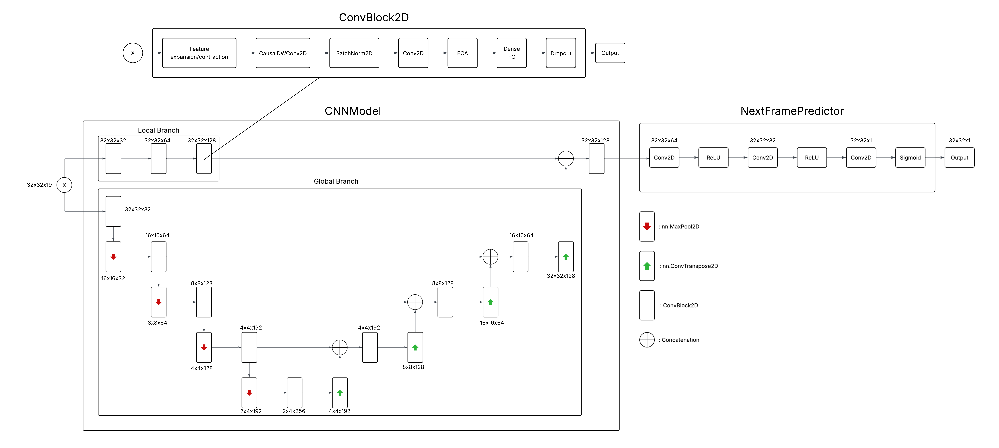

# CinderSight - Canadian Fire Prediction

Advanced wildfire prediction powered by neural networks.

## Background

Between 2018 and 2023, 7.7 million acres of U.S. land burned as a result of wildfires [[1]](#1), costing $70 billion annually [[2]](#2) and emitting 3.3 billion tons of CO2 every year [[3]](#3).

## Research Question

In this project, we wanted to see if we could take a successful fire-spread prediction model and apply it to a dataset with more covariates to improve its results.
The model used comes from the [2nd place submission](https://www.kaggle.com/competitions/2024-flame-ai-challenge/discussion/541458) to the [2024 FLAME AI Challenge](https://www.kaggle.com/competitions/2024-flame-ai-challenge/overview).

## Dataset

The dataset we used to train and evaluate the model is the [(Enhanced & modified) Next Day Wildfire Spread Dataset](https://www.kaggle.com/datasets/rufaiyusufzakari/enhanced-and-modified-next-day-wildfire-spread?select=next_day_wildfire_spread_eval_00.tfrecord), which is an enhanced version of the original [Next Day Wildfire Spread (NDWS) dataset](https://www.kaggle.com/datasets/fantineh/next-day-wildfire-spread) developed by Huot et al. (2022). 

### **Enhanced Dataset Features (19 Total)**

The enhanced dataset expands from the original 12 features to 19 features, providing a more comprehensive view of wildfire dynamics:

#### **Weather Factors (Current Day) - 8 Features**
- **Wind Speed (vs)**: Daily wind speed in m/s from GRIDMET (4 km resolution)
- **Precipitation (pr)**: Daily precipitation in mm/day from GRIDMET (4 km resolution)
- **Specific Humidity (sph)**: Daily specific humidity in kg/kg from GRIDMET (4 km resolution)
- **Max Temperature (tmmx)**: Daily maximum temperature in °C from GRIDMET (4 km resolution)
- **Min Temperature (tmmn)**: Daily minimum temperature in °C from GRIDMET (4 km resolution)
- **Wind Direction (th)**: Daily wind direction in degrees from GRIDMET (4 km resolution)
- **Energy Release Component (erc)**: Daily ERC from NFDRS (1 km resolution)
- **Drought Index (pdsi)**: Palmer Drought Severity Index from GRIDMET (4 km resolution)

#### **Weather Forecast (Next Day) - 4 Features**
- **Forecast Temperature (ftemp)**: Next-day temperature forecast in °C from NOAA GFS (27.83 km resolution)
- **Forecast Precipitation (fpr)**: Next-day precipitation forecast in mm/day from NOAA GFS (27.83 km resolution)
- **Forecast Wind Speed (fws)**: Next-day wind speed forecast in m/s from NOAA GFS (27.83 km resolution)
- **Forecast Wind Direction (fwd)**: Next-day wind direction forecast in degrees from NOAA GFS (27.83 km resolution)

#### **Terrain Factors - 3 Features**
- **Elevation**: Terrain elevation in meters from SRTM (30 m resolution, downsampled to 1 km)
- **Aspect**: Terrain aspect in degrees from SRTM (30 m resolution, downsampled to 1 km)
- **Slope**: Terrain slope in degrees from SRTM (30 m resolution, downsampled to 1 km)

#### **Vegetation Factors - 2 Features**
- **NDVI**: Normalized Difference Vegetation Index from VIIRS (500 m resolution, downsampled to 1 km)
- **EVI**: Enhanced Vegetation Index from VIIRS (500 m resolution, downsampled to 1 km)

#### **Human Factors - 1 Feature**
- **Population Density**: Population density in people/km² from GPWv4 (927.67 m resolution, downsampled to 1 km)

#### **Fire History - 1 Feature**
- **Previous Fire Mask (prevfiremask)**: Previous day fire mask from MODIS (1 km resolution)

### **Data Processing Pipeline**

#### Data Preprocessing (Enhanced Dataset Paper)

The enhanced dataset implements a comprehensive preprocessing pipeline to ensure high-quality inputs:

1. **Spatial Resolution Alignment**: All data sources are aligned to 1 km resolution to match fire mask resolution
   - Topography and vegetation data are downsampled using bicubic interpolation
   - Weather and drought data are upsampled using bicubic interpolation

2. **Temporal Alignment**: 
   - Hourly weather forecasts are aggregated to daily means
   - 16-day vegetation composites are linearly interpolated to daily values

3. **Value Clipping**: Features are clipped to remove extreme or unrealistic values
   - Physical constraints (e.g., 0-100% for percentages)
   - Statistical thresholds (0.1st to 99.9th percentiles)
   - Prevents vanishing/exploding gradients during training

4. **Normalization**: Features are normalized using mean and standard deviation from training dataset
   - Ensures consistent processing during inference
   - No prior fire presence information required

5. **Data Augmentation**: 
   - **Random Cropping**: 32×32 km regions randomly cropped from original 64×64 km regions
   - **Rotation**: Each sample rotated by 0°, 90°, 180°, and 270° to increase data variability
   - **Center Cropping**: Since fires are generally centered in the dataset, center cropping provides focused analysis

#### **Data Processing Implementation**

The dataset requires preprocessing before use in the model. This is handled by the `run_data_processing.py` script in the `model/` directory:

```bash
# Navigate to the model directory
cd model

# Check if all required packages are installed
python run_data_processing.py --check

# Run data visualization to explore the dataset
python run_data_processing.py --visualize

# Run data cleaning and processing
python run_data_processing.py --clean

# Run both visualization and cleaning
python run_data_processing.py --visualize --clean
```

The processing script performs:
- **Data Validation**: Ensures TFRecord files are present and accessible
- **Feature Statistics**: Calculates mean, std, min, max for all 19 features
- **Correlation Analysis**: Generates feature correlation matrices
- **Data Cleaning**: Applies clipping, normalization, and augmentation
- **Output Generation**: Creates processed data files ready for model training

**Note**: The raw dataset must be processed through this pipeline before the API can load and serve the data for visualization and prediction.

#### **Dataset Statistics**
- **Temporal Coverage**: July 2015 to October 2024 (extended from original 2012-2020)
- **Total Samples**: 39,333 (increased from original 18,545)
- **Spatial Resolution**: 1 km × 1 km
- **Input Resolution**: 64×64 pixels (64 km × 64 km regions)
- **Class Distribution**: 
  - Fire pixels: 1.34%
  - No-fire pixels: 97.81%
  - Unlabeled pixels: 0.85%

#### **Data Split**
- **Training**: 80% (31,466 samples)
- **Validation**: 10% (3,933 samples)
- **Testing**: 10% (3,933 samples)
- **Split Method**: Random split (not stratified) to maintain consistency with original NDWS methodology

**Note**: The Enhanced NDWS dataset has very limited temporal continuity between fire patterns. Fire sequence reconstruction analysis found only 10 sequences of length 2, indicating that fire masks in the dataset are mostly independent samples rather than connected temporal sequences. This means multi-timestep temporal modeling approaches using exact pattern matching are not viable with this dataset.

## Model Architecture

Due to the unfortunate lack of sequential data provided in the NDWS dataset, the temporal pieces of the architecture had to be removed or altered. Here is a diagram of the modified architecture, without the transformer and encoder blocks:



## Results

- F1 Score: 0.425
- Intersection over Union: 0.270
- Precision: 0.312
- Recall: 0.669
- Inference Speed: 51.0ms

## Live Demo

The application is currently deployed and accessible at:
- **Frontend**: [https://cindersight.netlify.app](https://cindersight.netlify.app)
- **Backend API**: [https://project-cindersight-production.up.railway.app](https://project-cindersight-production.up.railway.app)
- **API Documentation**: [https://project-cindersight-production.up.railway.app/docs](https://project-cindersight-production.up.railway.app/docs)

## Folder Structure

```
Project-CinderSight/
├── web/                 # Next.js Frontend with ShadCN UI
│   ├── src/
│   │   ├── app/        # Next.js 13+ App Router
│   │   ├── components/ # React Components (ShadCN + Custom)
│   │   └── lib/        # Utilities
│   └── Dockerfile
├── api/                 # FastAPI Backend with ML Integration
│   ├── app/
│   │   ├── main.py     # API endpoints and startup
│   │   ├── models.py   # FlameAIModel architecture
│   │   ├── config.py   # Feature configurations
│   │   ├── train.py    # Data loading and metrics
│   │   ├── visualization.py # Visualization endpoints
│   │   ├── generate_sample_visualizations.py # Core visualization logic
│   │   └── supabase_client.py # Supabase integration
│   ├── Dockerfile
│   ├── requirements.txt
│   └── railway.json
├── model/              # ML Model Training and Analysis
│   ├── models.py       # Original model architecture
│   ├── train.py        # Training scripts
│   ├── testing/        # Model testing and visualization
│   └── data/           # Data processing
└── docker-compose.yml  # Local Development
```

## Quick Start

### Prerequisites

- Docker and Docker Compose
- Node.js 18+ (for local development)
- Python 3.11+ (for local development)
- Supabase project with storage buckets configured (see [Supabase Setup](#supabase-setup))

### 1. Clone and Setup

```bash
git clone <repository-url>
cd Project-CinderSight
```

### 2. Environment Configuration

```bash
# Copy environment template
cp env.example .env

# Edit .env with your configuration
nano .env
```

**Important**: You must configure Supabase environment variables for the API to work. See the [Supabase Setup](#supabase-setup) section below.

### 3. Run with Docker Compose

```bash
# Start all services
docker-compose up --build

# Or run in background
docker-compose up -d --build
```

The application will be available at:
- **Frontend**: http://localhost:3000
- **Backend API**: http://localhost:8080
- **API Docs**: http://localhost:8080/docs

### 4. Local Development

#### Frontend (Next.js)
```bash
cd web
npm install
npm run dev
```

#### Backend (FastAPI)
```bash
cd api
pip install -r requirements.txt
uvicorn app.main:app --reload --host 0.0.0.0 --port 8080
```

## Usage

### 1. Access the Application
- Visit the live demo at [https://cindersight.netlify.app](https://cindersight.netlify.app)
- The application loads with a sample count and interactive visualization interface

### 2. Generate Visualizations
- Click "Load Random Sample" to select a random test sample
- Or click "Load Specific Sample" and enter a sample index (0-4193)
- The system will generate comprehensive visualizations including:
  - **19 Feature Maps**: Individual visualizations for each input feature (weather, terrain, vegetation, etc.)
  - **Fire Progression**: Previous fire mask, ground truth, and model predictions
  - **Performance Metrics**: Precision, Recall, F1 Score, and IoU calculations
  - **Confusion Matrix**: Detailed breakdown of prediction accuracy

### 3. View Results
- Monitor the generation progress in real-time
- Download the complete visualization package as a ZIP file
- Examine individual feature maps and fire spread predictions
- Analyze model performance metrics for the selected sample

## Technical Details

### Frontend Technologies
- **Next.js 14**: React framework with App Router
- **TypeScript**: Type-safe development
- **Tailwind CSS**: Utility-first styling
- **ShadCN UI**: Accessible components
- **Lucide React**: Beautiful icons

### Backend Technologies
- **FastAPI**: Modern Python web framework with automatic API documentation
- **PyTorch**: Deep learning framework for model inference
- **Supabase**: Backend-as-a-Service for data and model storage
- **Matplotlib**: Scientific plotting for visualizations
- **NumPy**: Numerical computing for data processing

### UI Components
- **Card**: Clean, organized content sections
- **Button**: Consistent, accessible buttons
- **Badge**: Risk level indicators
- **Input**: Form inputs with proper styling
- **Label**: Accessible form labels

## API Endpoints

### GET /health
Health check endpoint with system status.

**Response:**
```json
{
  "status": "healthy",
  "timestamp": "2024-01-15T10:30:00Z",
  "version": "1.0.0",
  "dependencies": {
    "numpy": "available",
    "torch": "available", 
    "matplotlib": "available"
  }
}
```

### GET /samples/count
Get the total number of available test samples.

**Response:**
```json
{
  "total_samples": 4194,
  "data_loaded": true
}
```

### POST /visualization/generate
Generate comprehensive visualizations for a specific sample.

**Request:**
```json
{
  "sample_idx": 0,
  "model_name": "model_nfp.pth"
}
```

**Response:**
```json
{
  "task_id": "task_12345",
  "status": "processing",
  "message": "Visualization generation started"
}
```

### GET /visualization/status/{task_id}
Check the status of a visualization generation task.

**Response:**
```json
{
  "task_id": "task_12345",
  "status": "completed",
  "progress": 100,
  "files": [
    "feature_00_vs.png",
    "feature_01_pr.png",
    "fire_previous_fire.png",
    "fire_ground_truth.png",
    "fire_prediction_probability.png",
    "metrics_performance_chart.png"
  ],
  "metrics": {
    "f1_score": 0.425,
    "iou": 0.270,
    "precision": 0.312,
    "recall": 0.669
  }
}
```

### GET /visualization/download/{task_id}
Download generated visualization files as a ZIP archive.

### GET /startup
Basic API health check for deployment verification.

## Development

### Frontend Development

The frontend is built with modern React patterns and ShadCN UI components:

1. **Components**: Located in `web/src/components/`
   - `ui/`: ShadCN UI components
   - `FireMap.tsx`: Interactive map component

2. **Pages**: Located in `web/src/app/`
   - `page.tsx`: Main application page
   - `layout.tsx`: Root layout with metadata

3. **Styling**: Tailwind CSS with custom design system

### Adding New Features

1. **Frontend Components**: Add to `web/src/components/`
2. **API Endpoints**: Add to `api/app/main.py`
3. **Visualization Logic**: Update `api/app/generate_sample_visualizations.py`
4. **Model Architecture**: Update `api/app/models.py`
5. **Data Processing**: Update `api/app/train.py`
6. **Supabase Integration**: Update `api/app/supabase_client.py`

### ShadCN UI Components

The project uses ShadCN UI for consistent, accessible components:

- **Button**: `@/components/ui/button`
- **Card**: `@/components/ui/card`
- **Badge**: `@/components/ui/badge`
- **Input**: `@/components/ui/input`
- **Label**: `@/components/ui/label`

### Testing

```bash
# Frontend tests
cd web
npm test

# Backend tests
cd api
pytest
```


## Supabase Setup

The API requires Supabase integration to fetch models and data from cloud storage. Follow these steps to set up Supabase:

### 1. Create Supabase Project

1. Go to [supabase.com](https://supabase.com) and create a new project
2. Note your project URL and service role key

### 2. Configure Environment Variables

Create a `.env` file in the `api/` directory:

```env
# Supabase Configuration
SUPABASE_URL=https://your-project-id.supabase.co
SUPABASE_SERVICE_ROLE_KEY=your-service-role-key-here

# API Configuration
API_HOST=0.0.0.0
API_PORT=8080
DEBUG=True

# CORS Configuration
ALLOWED_ORIGINS=http://localhost:3000,http://127.0.0.1:3000,https://your-frontend-domain.netlify.app

# Model and Data Configuration
DEFAULT_MODEL_NAME=model_nfp.pth
DEFAULT_DATA_SPLIT=test
```

### 3. Set Up Storage Buckets

1. Create two storage buckets in your Supabase project:
   - `models` - for model files
   - `data` - for data files

2. Upload your files:
   - **Models**: `model_nfp.pth` to the `models` bucket
   - **Data**: `test.data`, `test.labels`, `train.data`, `train.labels` to the `data` bucket

### 4. Create Database Tables

Run these SQL commands in your Supabase SQL editor:

```sql
-- Models table
CREATE TABLE models (
    id SERIAL PRIMARY KEY,
    model_name VARCHAR(255) NOT NULL,
    model_path TEXT NOT NULL,
    created_at TIMESTAMP DEFAULT NOW(),
    updated_at TIMESTAMP DEFAULT NOW()
);

-- Samples table
CREATE TABLE samples (
    id SERIAL PRIMARY KEY,
    name VARCHAR(255) NOT NULL,
    features_file_path TEXT NOT NULL,
    target_file_path TEXT NOT NULL,
    created_at TIMESTAMP DEFAULT NOW(),
    updated_at TIMESTAMP DEFAULT NOW()
);

-- Insert sample records (update URLs with your actual signed URLs)
INSERT INTO models (model_name, model_path) VALUES 
('model_nfp', 'https://your-project.supabase.co/storage/v1/object/sign/models/model_nfp.pth?token=your-signed-token');

INSERT INTO samples (name, features_file_path, target_file_path) VALUES 
('test', 'https://your-project.supabase.co/storage/v1/object/sign/data/test.data?token=your-signed-token', 'https://your-project.supabase.co/storage/v1/object/sign/data/test.labels?token=your-signed-token'),
('train', 'https://your-project.supabase.co/storage/v1/object/sign/data/train.data?token=your-signed-token', 'https://your-project.supabase.co/storage/v1/object/sign/data/train.labels?token=your-signed-token');
```

### 5. Test Integration

Run the test script to verify your setup:

```bash
cd api
python test_supabase.py
```

For detailed setup instructions, see [api/README_SUPABASE_SETUP.md](api/README_SUPABASE_SETUP.md).

## Key Features

###  **Advanced Fire Prediction Model**
- **FlameAIModel Architecture**: Complex neural network with CNN, transformer, and decoder components
- **19 Input Features**: Weather, terrain, vegetation, and human factors
- **Real-time Inference**: Fast prediction generation with PyTorch optimization

### **Comprehensive Visualizations**
- **Feature Maps**: Individual visualizations for all 19 input features
- **Fire Progression**: Previous fire mask, ground truth, and model predictions
- **Performance Metrics**: Precision, Recall, F1 Score, and IoU calculations
- **Confusion Matrix**: Detailed breakdown of prediction accuracy

### **Cloud-Native Architecture**
- **Supabase Integration**: Secure model and data storage with signed URLs
- **Railway Deployment**: Scalable backend hosting with automatic scaling
- **Netlify Frontend**: Fast, global CDN for the web interface
- **CORS Configuration**: Secure cross-origin communication

### **Production Ready**
- **Health Monitoring**: Comprehensive system status endpoints
- **Error Handling**: Robust error handling and graceful degradation
- **Logging**: Detailed logging for debugging and monitoring
- **Documentation**: Auto-generated API documentation with FastAPI

## Next Steps

1. **Enhanced Model Performance**: Optimize the FlameAIModel architecture for better accuracy
2. **Real-time Data Integration**: Connect to live weather and environmental data sources
3. **Geographic Expansion**: Extend beyond the current dataset to cover more regions
4. **Advanced Features**: Add historical analysis, evacuation routes, and risk assessment tools
5. **Model Interpretability**: Implement additional visualization techniques for model explainability

## References

<a id="1">[1]</a> 
National Interagency Fire Center

<a id="2">[2]</a> 
NOAA

<a id="3">[3]</a> 
Global Fire Emissions Database