Contents lists available at [ScienceDirect](www.sciencedirect.com/science/journal/23529385)

Remote Sensing Applications: Society and Environment

journal homepage: [www.elsevier.com/locate/rsase](https://www.elsevier.com/locate/rsase)

# An enhanced wildfire spread prediction using multimodal satellite imagery and deep learning models

#### Rufai Yusuf Zakari , Owais Ahmed Malik \* , Ong Wee-Hong

*School of Digital Science, Universiti Brunei Darussalam, Jalan Tungku 5 Link, BE1410, Brunei*

## ARTICLE INFO

*Keywords:* Remote sensing Deep learning Google earth engine Wildfire spread U-Net

### ABSTRACT

Wildfire spread prediction is critical for mitigating risks and improving management strategies. This study uses next-day weather forecasts and terrain features to enhance the Next Day Wildfire Spread (NDWS) dataset, initially designed for wildfire spread modeling. This enriched dataset spans from July 2015 to October 2024, incorporating forecast variables such as temperature, wind speed, wind direction, precipitation, slope, and aspect to complement existing elevation data. Leveraging this enriched dataset, we propose the Atrous Pyramid Attention U-Net (APAU-Net). This modified U-Net-based architecture combines Atrous Spatial Pyramid Convolution (ASPC) blocks and convolutional attention mechanisms to improve feature extraction and segmentation accuracy. The results demonstrate that APAU-Net, trained on the enhanced dataset, achieved an F1 Score of 0.720 and a mIoU of 0.635 on 64 × 64 resolution, and an F1 Score of 0.689 and mean Intersection over Union (mloU) of 0.605 on 32 × 32 resolution. These results demonstrate notable improvements compared to prior studies and existing methods. Comprehensive ablation studies were then conducted using APAU-Net to evaluate the contributions of different feature groups, revealing the importance of integrating weather, topography, and previous fire activity for accurate predictions. Additionally, Integrated Gradients were utilized to provide interpretability for the model's decisions, offering an understanding of the significance of each feature in the prediction process. The computational efficiency of APAU-Net was also evaluated, showing a significant reduction in training time compared to previous models, making it a viable solution for real-time applications. The APAU-Net model provides an effective approach for predicting the next day's wildfire spread, providing a valuable tool for improving wildfire risk management and response strategies in the face of increasingly complex wildfire behavior.

# **1. Introduction**

Wildfires are among the most destructive natural disasters, endangering ecosystems, infrastructure, and global human lives ([Kale](#page-19-0) [et al., 2022\)](#page-19-0). Climate change has exacerbated the frequency and intensity of wildfires in recent years, leading to prolonged droughts, increased temperatures, and more extreme weather events. This growing threat highlights the need for advanced predictive measures to support wildfire management, resource allocation, and mitigation strategies (O'[Mara et al., 2024\)](#page-19-0). Accurate wildfire spread prediction enables early warning systems, guides evacuation plans, and optimizes firefighting efforts to minimize damage. Predicting

\* Corresponding author. *E-mail addresses:* [21h8562@ubd.edu.bn](mailto:21h8562@ubd.edu.bn) (R.Y. Zakari), [owais.malik@ubd.edu.bn](mailto:owais.malik@ubd.edu.bn) (O.A. Malik), [weehong.ong@ubd.edu.bn](mailto:weehong.ong@ubd.edu.bn) (O. Wee-Hong).

<https://doi.org/10.1016/j.rsase.2025.101632>

Received 1 March 2025; Received in revised form 13 May 2025; Accepted 13 June 2025

Available online 13 June 2025

2352-9385/© 2025 Elsevier B.V. All rights are reserved, including those for text and data mining, AI training, and similar technologies.

wildfire spread is inherently complex, involving many factors, including topography, vegetation, and highly dynamic weather conditions, such as wind speed and direction [\(Chen et al., 2024](#page-19-0)). Each of these variables interacts nonlinearly, making traditional modeling approaches, such as those based on empirical or physics-based equations, less effective in capturing the intricacies of wildfire behavior under diverse environmental conditions [\(Grasso and Innocente, 2020\)](#page-19-0). Abrupt changes in wind direction or fuel moisture can drastically alter the trajectory and intensity of a fire. Moreover, the spatial heterogeneity of landscapes and the temporal dynamics of weather add an additional layer of complexity to the prediction task [\(Fang et al., 2018](#page-19-0)).

Recent advancements in satellite remote sensing (RS) and deep learning (DL) have enabled the use of high-resolution multimodal datasets [\(Kanwal et al., 2023](#page-19-0)). For instance, hyperspectral image techniques, such as unsupervised methods like UDALN ([Li et al.,](#page-19-0) [2022\)](#page-19-0), C2F [\(Li et al., 2023a\)](#page-19-0), M2U-Net ([Li et al., 2024\)](#page-19-0), enhance spatial and spectral resolution by combining low-resolution hyperspectral data with high-resolution multispectral imagery. Satellite imagery provides comprehensive, multimodal datasets capturing real-time observations of critical factors, such as vegetation indices, soil moisture, and thermal anomalies, across vast spatial extents. These datasets enable researchers to incorporate high-resolution information about topography, vegetation, and weather into predictive models, offering a holistic understanding of wildfire dynamics ([Smith et al., 2023](#page-19-0)). However, integrating and effectively utilizing these diverse data sources for prediction remains a significant computational and methodological challenge. Traditional ML approaches, such as decision trees and random forests, rely heavily on handcrafted feature extraction and often struggle to model the complex, nonlinear interactions between environmental factors. These models require extensive preprocessing and may fail to capture spatial dependencies that are critical for accurately predicting wildfire spread. DL has recently emerged as a powerful approach for modeling complex, nonlinear relationships between various environmental factors affecting wildfire dynamics. These models excel at handling large, multimodal datasets and learning from complex patterns in the data. DL approaches have the ability to automatically extract high-level features from raw data, offering a powerful tool for wildfire prediction ([Andrianarivony and Akhloufi, 2024](#page-18-0)). Building on the successes of these DL models, U-Net, a Convolutional Neural Network (CNN) introduced by [\(Ronneberger et al., 2015](#page-19-0)), was originally designed for biomedical image segmentation. It's widely used to tackle medical imaging problems such as liver diseases segmentation [\(Liu et al., 2025](#page-19-0)). U-Net's architecture has demonstrated remarkable versatility across various domains, with recent variants showcasing innovative approaches to multimodal data integration [\(Li et al., 2025a\)](#page-19-0), [\(Li et al., 2023b\)](#page-19-0). Inspired by their effectiveness in capturing spatial features from satellite data, U-Net-based architecture has also been explored in remote sensing applications, including wildfire spread prediction ([Li and Rad, 2024\)](#page-19-0).

Despite these advances, existing DL models often underperform due to methodological limitations, such as choice of loss functions, evaluation metrics, and reliance on incomplete datasets, which are critical for optimizing model performance in wildfire prediction. For instance, the Next Day Wildfire Spread (NDWS) dataset ([Huot et al., 2022\)](#page-19-0), originally introduced as a benchmark for predicting wildfire spread in the United States from 2012 to 2020, is its reliance on historical weather conditions, excluding weather forecasts essential for capturing the dynamic nature of wildfire spread. The dataset includes 12 input features, represented as 64 × 64-pixel grids, where each pixel corresponds to a 1 km × 1 km area. However, it lacks forecast variables such as wind speed, wind direction, precipitation, and temperature, which are critical for understanding how fires might intensify, shift direction, or be extinguished. The omission of key terrain features such as slope and aspect, which influence fire propagation, limits the dataset's ability to model geographic factors. The integration of variables capture the dynamic nature of wildfire spread under changing conditions, enabling the model to anticipate real-time fire behavior. As a result, existing wildfire spread models trained on NDWS struggle to anticipate real-time fire behavior, particularly in rapidly evolving conditions. A key strength of our study is the enhancement of the NDWS dataset through the integration of weather forecasts and terrain features. These additions address gaps in the NDWS dataset, enabling more accurate predictions of wildfire spread under dynamic conditions.

To address these limitations, this study enhanced the NDWS dataset by integrating weather forecasts and terrain features, providing a richer context for modeling wildfires and enabling more accurate predictions. Building on this enriched dataset, we propose the Atrous Pyramid Attention U-Net (APAU-Net), a modified U-Net-based architecture to predict the spread of wildfire the next day. Unlike conventional U-Net-based architectures, such as Attention U-Net, which primarily rely on attention mechanisms to enhance feature extraction, APAU-Net integrates both Atrous Spatial Pyramid Convolution (ASPC) blocks and convolutional attention mechanisms. This dual approach ensures comprehensive feature extraction across multiple scales, capturing fine-grained details critical for modeling complex wildfire dynamics. To further adapt to the domain-specific challenges of wildfire predictions, such as class imbalance between fire and no-fire pixels and the need for precise segmentation, we utilized a custom loss function and employed a comprehensive set of evaluation metrics. These enhancements enable APAU-Net to provide improved prediction accuracy and segmentation performance over traditional U-Net models, particularly in its ability to better capture fine-grained wildfire spread patterns. To ensure transparency and interpretability of our predictive models, we employed Integrated Gradients (IG), a state-of-the-art technique for feature attribution. IG quantifies the contribution of each input feature to the model's predictions, enabling us to identify the variables most critical for wildfire spread. This approach enhances the trustworthiness of our model and provides actionable insights for stakeholders involved in wildfire management. By providing accurate and timely wildfire spread predictions, our proposed APAU-Net model supports enhanced decision-making in firefighting strategies, resource allocation, and evacuation planning. The model's computational efficiency and integration of enriched datasets enable near-real-time prediction, empowering government agencies, disaster response teams, and environmental organizations to mitigate wildfire risks and minimize potential damage effectively.

#### *1.1. Objectives*

This study aims to address critical limitations in existing wildfire prediction approaches through the following specific objectives:

- To modify and enrich the Next Day Wildfire Spread (NDWS) dataset by integrating weather forecasts (wind speed, wind direction, precipitation, and temperature) and terrain features (slope and aspect) that are essential for capturing the dynamic nature of wildfire spread.
- To design and implement the Atrous Pyramid Attention U-Net (APAU-Net), a novel DL architecture that combines Atrous Spatial Pyramid Convolution (ASPC) blocks with convolutional attention mechanisms to improve feature extraction and segmentation accuracy.
- To develop a custom loss function that addresses the class imbalance between fire and no-fire pixels while enhancing the precision of wildfire boundary predictions, thereby improving overall segmentation performance.
- To conduct comprehensive ablation studies evaluating the impact of different input feature groups on model performance, supplemented by explainability techniques such as IG providing an understanding into feature importance.
- To demonstrate how improved wildfire spread predictions can support decision-making in firefighting strategies, resource allocation, and evacuation planning.

The paper is organized as follows: Section 2 reviews related works relevant to wildfire prediction. Section [3,](#page-3-0) titled "Materials," describes the study area and datasets used in this study. Section [4](#page-5-0) presents the proposed methodology. Section [5](#page-9-0) showcases the outcomes obtained from our study. Section [6](#page-14-0) offers detailed discussion and interpretation of the findings. Finally, in the conclusion section, we present our final remarks.

### **2. Related works**

Wildfire prediction has undergone a significant evolution, shifting from traditional statistical approaches to the adoption of advanced machine learning algorithms (MLAs) ([Zhou et al., 2025\)](#page-19-0). The earliest approaches to predicting wildfire spread, such as the Canadian Forest Fire Behavior Prediction System (CFFBPS), were developed using empirical data and theoretical principles to model the fire propagation process ([Shadrin et al., 2024](#page-19-0)). These methods, while foundational, often struggled to account for the complex, dynamic interactions of environmental factors influencing wildfire behavior. Recent advancements have highlighted the potential of ML, particularly DL, in modeling the complex dynamics of wildfire progression ([Jain et al., 2020](#page-19-0)). For example ([Singh et al., 2023](#page-19-0)), highlighted gaps in wildfire growth prediction, focusing on the need for models that can handle extreme weather dynamics and improve parameter estimation. Similarly ([Hodges and Lattimer, 2019\)](#page-19-0), proposed DCIGN, which showed computational efficiency but lacked validation with real-world data. [Radke et al. \(2019\)](#page-19-0) introduced FireCast, a DL tool that outperformed traditional models like FARSITE but faced limitations in generalizing to diverse geographic regions. Alliare et al. [\(Allaire et al., 2021](#page-18-0)) proposed a deep neural network (DNN) with a hybrid architecture to handle 2D environmental parameters and scalar inputs for regression tasks. Similarly [\(Bolt et al., 2022](#page-18-0)), introduced a DNN-based emulator that approximates the fire front, providing a tool for simulating various fire scenarios under different environmental conditions. Burge et al. ([Burge et al.](#page-18-0)) demonstrated the effectiveness of the ConvLSTM model on simulated data, showing its ability to capture both local fire transmission events and overall fire dynamics, such as spread rates. However, a key limitation of using simulated data is that it may not fully capture real-world fire behavior's unpredictable and highly variable nature, limiting the model's applicability to actual wildfire scenarios ([Beyki et al.](#page-18-0)).

To further advance wildfire spread modeling ([Huot et al., 2022\)](#page-19-0), the NDWS dataset to fulfill the need for a comprehensive, multivariate dataset tailored for ML applications in wildfire prediction. They validated the dataset's utility by implementing a convolutional autoencoder for predicting wildfire spread and benchmarking its performance against logistic regression and random forest models. Their results highlighted the NDWS dataset's potential as a foundational resource for data-driven wildfire propagation research. In their study, they utilized the ROC-AUC metric to evaluate their model. However, due to the dataset's imbalance, with an overrepresentation of negative samples, this metric may not have provided an ideal measure of performance. Utilizing this dataset, subsequent research has introduced advanced modeling techniques to enhance prediction accuracy. For instance [\(Shah and Pantoja,](#page-19-0) [2023\)](#page-19-0), adjusted the temporal resolution between fire observations from one day to 30 min, which improved short-term granularity but could limit the model's suitability for longer-term predictions. Similarly [\(Marjani and Mesgari, 2023](#page-19-0)), employed a CNN-based approach similar to the one used during the dataset's initial release but relied on a small subset of data for training and testing, raising concerns about generalizability. Additionally [\(Fitzgerald et al., 2023\)](#page-19-0), explored a range of variant U-Net architectures enhanced with attention mechanisms, focusing on improving training efficiency. Meanwhile [\(Ali et al., 2022](#page-18-0)), introduced new data modalities and increased the spatial resolution of the fire masks within the NDWS framework. However, their work did not include an evaluation of models on the updated dataset, leaving its potential unexplored. Other studies have focused on specific types of wildfires, such as bushfires, as seen in [\(Sharma et al., 2023](#page-19-0)), narrowing their scope but offering insights into specialized fire behavior. [Singh et al.](#page-19-0) [\(2023\)](#page-19-0) applied various ML algorithms for next-day wildfire growth prediction, using RMSE for evaluation. However, RMSE is unsuitable for binary segmentation tasks, as it fails to account for the spatial accuracy of fire and no-fire predictions. A more recent study [\(Li and Rad, 2024\)](#page-19-0), introduced the Attention Swin U-Net with Focal Modulation (ASUFM), featuring Transformer blocks with LayerNorm and focal modulation, to improve predictive performance on the NDWS benchmark. This model was trained on an expanded dataset covering wildfire data across North America. Despite its success in prediction, the model only demonstrates a limited increase in performance. [Xiao et al. \(2024\)](#page-19-0) introduced Attention U2-Net, which utilizes attention mechanisms to improve performance. However, the model's increased complexity may limit its practical effectiveness. While these studies have employed a range of DL models, particularly U-Net and its variants, with the NDWS dataset, improvements in predictive performance have shown limited variation, with F1 scores consistently falling between 0.31 and 4.10. Therefore, these models may often fail to capture multi-scale terrain influences and dynamic fire-weather interactions, which are critical for accurately predicting wildfire spread.

# **3. Materials**

# *3.1. Study area*

The study focuses on the contiguous United States, which includes 48 states located on the mainland of North America, excluding Alaska and Hawaii, spanning a total area of approximately 8,080,470 km2 , with 7,663,940 km2 of land. The U.S. features significant geographic diversity, leading to various climatic conditions. It is home to 63 national parks, which are federally protected areas managed by the National Park Service. Wildfires are a common occurrence across the U.S., particularly during drought. They are most frequent in the Western U.S. and Florida, where dry conditions and dense vegetation create favorable fire ignition and spread environments. The contiguous United States was selected due to its high wildfire incidence, ecological and climatic diversity, and the availability of comprehensive geospatial and fire incident data, making it a suitable and representative region for developing and validating wildfire risk models. Due to the country's vast expanse and diverse geography, wildfire represents a major risk to forest ecosystems and human communities. Fig. 1 illustrates the study area, displaying the contiguous United States along with elevation data.

# *3.2. Datasets*

Building on the NDWS dataset developed by [\(Huot et al., 2022\)](#page-19-0) using Google Earth Engine (GEE), this study enhances it by extending its temporal coverage and incorporating additional features. While the original NDWS dataset comprises 12 observational variables and wildfire masks overlaid on 2D regions at a 1 km spatial resolution, it contains 18,545 samples from platforms such as MODIS, VIIRS, SRTM, and GOES. The enhanced dataset includes 19 features, significantly expanding its scope and utility. The temporal coverage was extended to include data from July 2015 to October 2024, leveraging the availability of forecast data starting in mid-2015. Key forecast variables integrated into the dataset are temperature, wind speed, wind direction, and precipitation. [Table 1](#page-4-0) provides a summary of the input variables utilized in this study. These input variables were chosen because they represent key environmental, topographical, and human-related factors that are scientifically known to influence wildfire behavior. [Fig. 2](#page-4-0) presents a comprehensive overview, illustrating each of the 19 individual features. Detailed descriptions of supporting datasets are provided below:

**Historical Wildfire Data:** Historical wildfire data for this study is derived from the MOD14A1 Version 6 dataset [\(Giglio, 2015](#page-19-0)), which provides daily fire mask composites at a spatial resolution of 1 km. Maintained by NASA's Land Processes Distributed Active Archive Center (LP DAAC) at the USGS Earth Resources Observation and Science (EROS) Center, this dataset has been available since

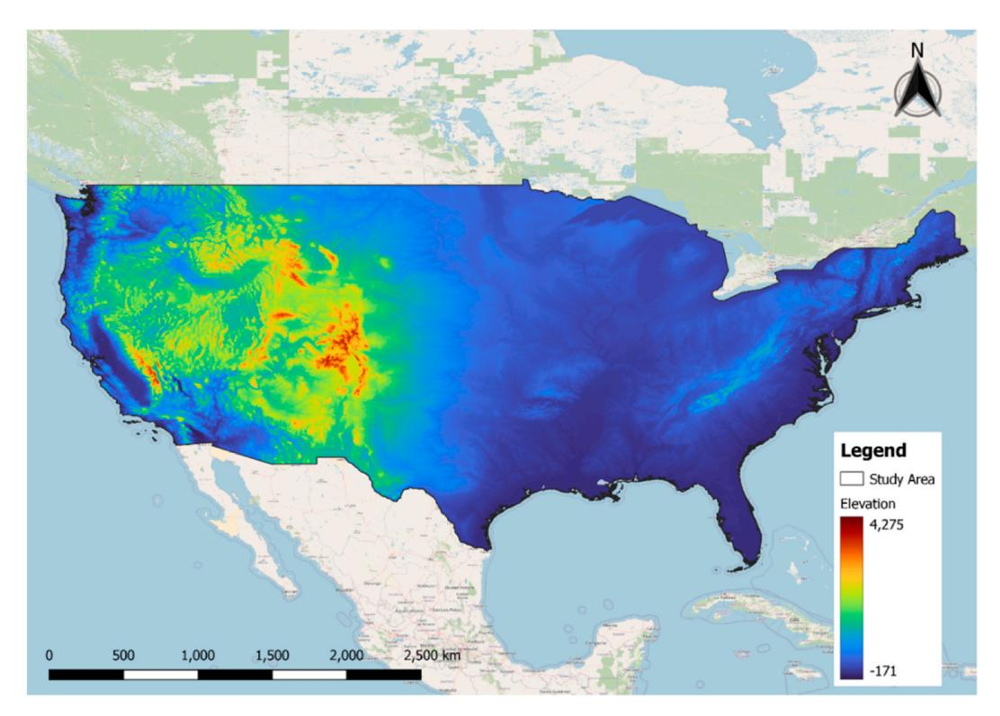

**Fig. 1.** Study area showing the elevation map of the contiguous United States, with elevation highlighting the diverse topography relevant for wildfire spread.

Summary of input variables used in this study.

| Category                                  |                               | Variables                                                                                                                                                                                             | Source                                  | Spatial resolution |  |
|-------------------------------------------|-------------------------------|-------------------------------------------------------------------------------------------------------------------------------------------------------------------------------------------------------|-----------------------------------------|--------------------|--|
| Wildfire record mask (Dependent variable) |                               | Next day fire mask (Firemask) Previous day fire mask (PrevFireMask)                                                                                                                                | MODIS/061/MOD14A1                       | 1 km               |  |
| Independent variables                     | Weather factors (current day) | Wind speed (vs) Precipitation (pr) Specific humidity (sph) Max temperature (tmmx) Min temperature (tmmn) Wind Direction (th) Energy release component (erc) Drought index (pdsi) | IDAHO_EPSCOR/GRIDMET GRIDMET/DROUGHT | 4 km –          |  |
|                                           | Weather forecast (next day)   | Temperature (ftemp) Precipitation (fpr) Wind speed (fws) Wind Direction (fwd)                                                                                                                | NOAA/GFS0P25                            | 27830 m            |  |
|                                           | Terrain factor                | Elevation Aspect Slope                                                                                                                                                                          | USGS/SRTMGL1_003                        |                    |  |
|                                           | Vegetation                    | NDVI EVI                                                                                                                                                                                           | NOAA/VIIRS/VNP13A1                      | 500 m              |  |
|                                           | Human factor                  | Population density (population)                                                                                                                                                                       | CIESIN/GPWv411/GPW                      | 927.67 m           |  |

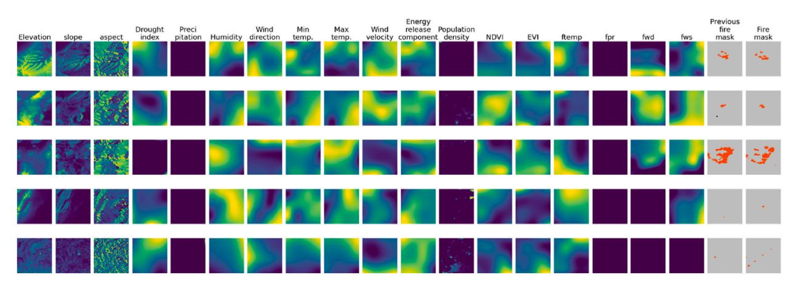

**Fig. 2.** Examples from our enhanced dataset, each representing a 64 km × 64 km region with 1 km spatial resolution. Each row captures a specific location and time *t* when a fire was active, and the columns display the associated input variables. The "previous fire mask" indicates fire presence at time *t*, while the "fire mask" shows fire locations on the following day (*t* + 1). In these masks, red denotes active fire and gray indicates no fire.

2000. It includes key wildfire detection information such as location, timing, and intensity, making it a valuable resource for studying historical fire patterns and their behavior over extended periods.

**Weather Data:** Weather data was obtained from the GRIDMET dataset (IDAHO\_EPSCOR/GRIDMET) [\(Abatzoglou, 2013](#page-18-0)), which provides daily meteorological variables at a spatial resolution of 4 km. These variables include minimum and maximum temperatures, wind speed, humidity, precipitation, and the Palmer Drought Severity Index (PDSI). The dataset includes the energy release component (ERC), which measures the energy released during combustion, and fuel moisture, which represents the moisture content in vegetation and its potential to act as fuel for wildfires ([Jones et al., 2022](#page-19-0)). The energy release component (ERC) data was obtained from the National Fire Danger Rating System (NFDRS) [\(Bradshaw et al., 1983](#page-18-0)).

**Weather Forecasts:** The Global Forecast System (GFS), obtained from NOAA's GFS0P25 dataset, offers hourly weather forecasts at a spatial resolution of approximately 27.83 km. These forecasts are similar to those provided by GRIDMET, with some key differences. GFS reports average temperature instead of separate minimum and maximum temperatures and represents wind data as *u* and *v* vector components. To maintain consistency with GRIDMET, we converted these components into overall wind speed and direction. GFS updates its predictions four times daily at hourly intervals. To align these frequent forecasts with our 24-h modeling framework, we consolidated the hourly predictions into a single aggregated daily forecast ([Gerard et al.\)](#page-19-0).

**Vegetation Data:** Vegetation indices, such as NDVI and EVI, were retrieved from the VIIRS dataset (NOAA/VIIRS/VNP13A1). These indices provide insights into vegetation health and density, which are critical factors in assessing fuel availability for wildfire spread.

**Population Density:** Population density data was sourced from the CIESIN GPWv4 dataset, providing granular information on

human distribution. Understanding population density is important for assessing the human impact on wildfire ignition and propagation.

**Topography Data:** Topography data was obtained from the Shuttle Radar Topography Mission (SRTM) ([Farr et al., 2007](#page-19-0)), which provides elevation information with a resolution of 30 m. Since elevation data remains relatively stable, using 2000 data is appropriate. Topographic features such as slope and aspect, derived from elevation, play a critical role in wildfire spread. Fires tend to propagate faster uphill due to rising heat and pre-heating of vegetation at higher elevations, while downhill spread is slower. This makes topography a vital variable in modeling wildfire dynamics.

# **4. Methodology**

The task of wildfire spread prediction is defined as follows: Given a set of observed spatial features {*x*1*,x*2*,*…*,xn*}, where each *xi*  represents an observed spatial feature influencing wildfire spread (e.g., temperature, NDVI, and precipitation), along with the corresponding fire mask at the current time step *Mt*, referred to as the "previous fire mask," the objective is to predict the fire mask for the next day, *Mt*+1, referred to as the "fire mask," using a prediction model *f*. The observed spatial features are structured into *m* channels of input data, organized as a grid with *n* × *n* spatial resolution. The previous fire mask *Mt* provides essential spatial context by representing the wildfire's spatial distribution at the current time step, which guides the prediction for the next day. The problem is mathematically defined as:

$$
M_{t+1} = f(\{x_1, x_2, ..., x_n\}, M_t)
$$

Where *xi* ∈ R*n*×*n*×*m*represents the observed spatial features at time step *t*, where *m* is the number of input channels and *n*× *n* represents the spatial resolution of the grid. *Mt* ∈ R*n*×*n*is the fire mask at time *t* (previous fire mask), which provides the spatial distribution of wildfire at the current time step. *Mt*+1 ∈ R*n*×*n*is the fire mask at time *t* + 1 representing the predicted wildfire spread for the next day. The prediction model *f* learns the spatial relationships between the input features ({*x*1*, x*2*,*…*, xn*}) and the previous fire mask (*Mt*) to accurately predict the wildfire spread for the next day (*Mt*+1). Fig. 3 illustrates a typical framework for training a deep learning-based segmentation model to predict wildfire spread.

# *4.1. Data preprocessing*

To ensure high-quality inputs for the model, we preprocess each data feature, excluding fire masks, by clipping values within set limits to remove extreme or unrealistic values. Temporal alignment involved aggregating hourly forecasts to daily means and linearly interpolating 16-day vegetation composites. Clipping thresholds are either based on physical constraints (e.g., between 0 % and 100 %) or determined using the 0.1st and 99.9th percentiles. This prevents issues like vanishing or exploding gradients during training. After clipping, features are normalized using their mean and standard deviation, calculated from the training dataset ([Huot et al.,](#page-19-0) [2022\)](#page-19-0). This ensures consistent processing during inference without needing prior fire presence information. Our preprocessing pipeline includes several key steps:

- All data sources are aligned to a 1 km resolution for data alignment, matching the resolution of fire masks, with topography and vegetation downsampled and bicubic interpolation applied to weather and drought data.
- Input features include environmental variables and the "previous fire mask" at time t, while the "fire mask" at t+1 day serves as the target label.
- Feature values are clipped between minimum and maximum values based on physical knowledge or percentiles (0.1st to 99.9th) to handle extreme and unrealistic values.
- Normalization is performed by subtracting the mean and dividing by the standard deviation for each feature, with statistics calculated from the training dataset after clipping.
- Data augmentation is performed by randomly cropping 32 km × 32 km regions from original 64 km × 64 km regions, as fires are generally centered in the dataset.

We maintained the data split approach used in the NDWS dataset to ensure consistency and facilitate robust comparisons with previous work. Specifically, we divided the dataset into training, validation, and testing sets by randomly separating all the data using an 80:10:10 ratio. Stratified sampling was not employed, meaning the split was random without ensuring an even distribution of wildfire events across the sets. This consistent splitting ensures that the enhanced dataset remains aligned with the methodology of the

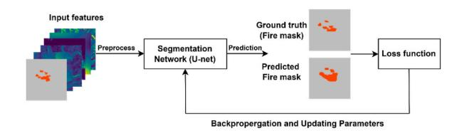

**Fig. 3.** A typical scheme for training a deep learning-based segmentation network for wildfire spread prediction.

original NDWS dataset while providing additional features and extended temporal coverage for improved wildfire modeling. In the fire segmentation masks, it contains three distinct classes: − 1 (unlabeled or no data), 0 (no fire), and 1 (fire). Exploratory analysis of the dataset (comprising 39,333 samples) reveals wildfire spread dynamics with fire pixels increasing from 1,672,312 in the previous day fire mask to 2,155,563 in the next day fire mask, reflecting a 28.90 % growth into new regions, accompanied by a 0.23 % decrease in no-fire pixels and a 7.98 % reduction in unlabeled pixels. The FireMask shows that fire pixels account for 1.34 %, no-fire pixels dominate at 97.81 %, and unlabeled pixels make up 0.85 %, indicating a significant class imbalance. Table 2 presents a comparison between the Original NDWS and the Enhanced NDWS datasets.

#### *4.2. Model architecture*

In this study, we propose APAU-Net, a modified model based on the U-Net architecture designed for next-day wildfire spread prediction. U-Net has been widely used for segmentation tasks due to its efficient use of encoder-decoder structures and skip connections that help capture spatial hierarchies. The motivation for choosing U-Net as the backbone comes from its proven effectiveness in pixel-level predictions, particularly in complex environments like wildfire modeling, where precise spatial segmentation is crucial. APAU-Net builds upon the attention of U-Net to enhance segmentation performance by incorporating advanced convolutional techniques to improve segmentation performance. As shown in [Fig. 4](#page-7-0), the model leverages the strengths of multi-scale feature extraction and attention mechanisms to capture complex patterns in wildfire dynamics effectively. APAU-Net consists of an encoder path, a decoder path, and key innovations such as the Atrous Spatial Pyramid Convolution (ASPC) blocks and attention-based skip connections that enhance model performance.

The encoder path of APAU-Net replaces standard convolutional layers with ASPC blocks, which apply dilated convolutions with different dilation rates. This enables the model to capture features across multiple scales and gather more detailed information about the input image. Inspired by the Atrous Spatial Pyramid Pooling (ASPP) technique [\(Chen et al., 2018\)](#page-19-0), ASPC adapts this concept by using dilated convolutions instead of pooling operations. Specifically, the ASPC block includes four convolutional layers: the first with a dilation rate of 1, the second with a dilation rate of 2, the third with a dilation rate of 3, and the fourth being a 1 × 1 convolution. The outputs from these convolutions are summed together to create a richer, multi-scale representation of the input. A residual connection is added to the output, ensuring better gradient flow during training and preventing the loss of important spatial information. Batch normalization, ReLU activation, and dropout are applied to improve stability and prevent overfitting. The encoder progressively reduces the spatial resolution of the input image while increasing the feature depth at each stage: 64, 128, 256, 512, and 1024. This increase in feature depth enables the model to capture increasingly abstract and global features while reducing spatial resolution using max-pooling layers.

In the decoder path, APAU-Net mirrors the encoder's structure but utilizes upsampling blocks with bilinear interpolation or transpose convolutions to progressively restore the feature maps to the original resolution. Each upsampling block is followed by a 3 × 3 convolution, batch normalization, and ReLU activation to refine the feature representations. This hierarchical upsampling process ensures that spatial details lost during encoding are effectively recovered. To preserve fine-grained spatial information, skip connections are employed to concatenate feature maps from corresponding encoder layers with the decoder's upsampled outputs. However, instead of direct concatenation, APAU-Net enhances these connections with attention blocks that dynamically weigh the encoder features before merging them with the decoder features. The attention blocks selectively emphasize important regions, enabling the model to focus on critical wildfire-affected areas while suppressing irrelevant background noise.

The output of APAU-Net is generated using a 1 × 1 convolution that produces a binary mask, representing fire versus no-fire areas. This output is a key component for wildfire prediction, allowing the model to delineate areas impacted by fire accurately. The combination of ASPC blocks for multi-scale feature extraction, attention-based skip connections, and residual learning makes APAU-Net a powerful architecture for wildfire prediction, effectively leveraging local and global information from complex datasets. This model design ensures robust performance in segmenting fire areas and predicting future wildfire spread.

# *4.3. Evaluation metrics*

The performance of all models, including APAU-Net, was evaluated using standard segmentation metrics to assess their ability to predict wildfire spread, specifically focusing on the wildfire class. These metrics include mean Intersection over Union (mloU), Precision, Recall, F1-score, and PR-AUC. Each metric provides a unique understanding of the model's predictive capabilities, ensuring a comprehensive evaluation of its performance. The Intersection over Union (loU) measures the overlap between the predicted segmentation mask and the ground truth mask for a specific class. A fixed threshold of 0.5 was applied to convert model output probabilities into binary predictions for the wildfire class, which was used for calculating all evaluation metrics. It is defined as the ratio of the intersection area to the union area of the two masks:

# **Table 2**

Comparison of original and enhanced NDWS datasets.

| 2012–2020 NDWS Original (Huot et al., 2022) United States 18,545 NDWS Extended (Li and Rad, 2024) 2012–2023 North America 31,760 | Dataset         | Temporal Coverage | Location      | Total Samples |
|-------------------------------------------------------------------------------------------------------------------------------------------------------|-----------------|-------------------|---------------|---------------|
|                                                                                                                                                       | NDWS (Enhanced) | 2015–2024         | United States | 39,333        |

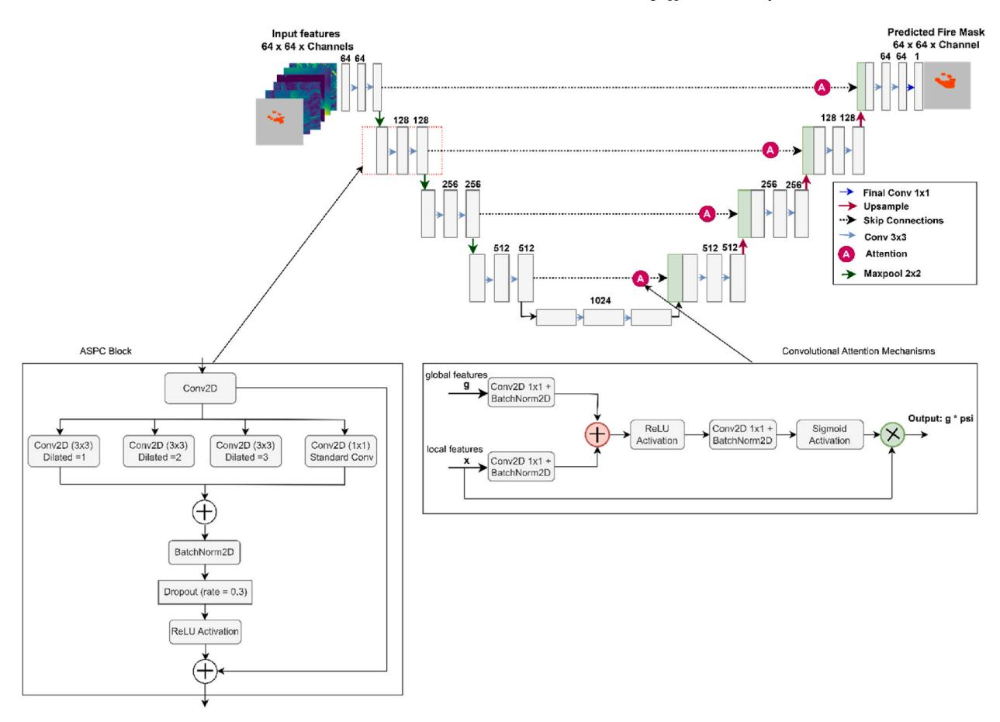

**Fig. 4.** The proposed APAU-Net Architecture.

$$
IoU_c = \frac{\text{Intersection}_c}{\text{Union}_c} = \frac{\sum_{i} 1_{y_i = \hat{y}_i = c}}{\sum_{i} 1_{y_i = c} + \sum_{i} 1_{\hat{y}_i = c} - \sum_{i} 1_{y_i = \hat{y}_i = c}} \tag{1}
$$

Where *yi* represents the ground truth label for pixel *i*, ̂*yi* represents the predicted label for the pixel *i*, and *c* denotes the class of interest (e.g., fire or no-fire). The mean loU (mloU) is then computed by averaging the IoU across all classes:

Mean-IoU = 
$$
\frac{1}{|C|} \sum_{c \in C} IoU_c
$$
 (2)

IOU is particularly effective at penalizing under-segmentation (missing fire pixels) and over-segmentation (incorrectly predicting fire pixels). Precision and Recall are fundamental metrics for binary classification tasks, providing an understanding of the trade-off between false positives and false negatives. Precision measures the proportion of correctly predicted fire pixels among all pixels predicted as fire:

$$
Precision = \frac{True \; Positive \; (TP)}{True \; Positive \; (TP) + False \; Positive \; (FP)}
$$
\n
$$
(3)
$$

Recall (also known as sensitivity) measures the proportion of correctly predicted fire pixels among all actual fire pixels:

$$
Recall = \frac{True \; Positives \; (TP)}{True \; Positives \; (TP) + False \; Negatives \; (FN)}
$$
\n
$$
(4)
$$

The F1-score is the harmonic mean of precision and recall, providing a single metric that balances these two aspects:

$$
F1-Score = 2 \cdot \frac{Precision + Recall}{Precision + Recall}
$$
\n(5)

For multi-class problems, the F1 Score is computed separately for each class and then averaged. In our experiments, we report the mean F1 Score across both fire and no-fire classes. The F1 Score is particularly useful in scenarios with imbalanced datasets. Finally, the area under this curve (PR-AUC) summarizes the model's ability to balance precision and recall across all thresholds. PR-AUC is especially informative for imbalanced datasets, as it focuses on the performance of the minority class.

## *4.4. Model training*

The dataset comprised of 19 input features {*x*1*,x*2*,*…*,xn*}, some of which may be considered less significant for the prediction task. To evaluate their significance, we conducted experiments by reducing the number of input features to assess how this reduction would impact on the overall performance of the models. In our experiments, we used the RMSprop optimizer to update model parameters. RMSprop, widely utilized in DL, is particularly effective for tasks involving non-stationary objectives or sparse gradients. It dynamically adjusts the learning rate for each parameter, enhancing optimization, stability, and performance. The model was trained for 15 epochs with a batch size of 64. While several learning rates and momentum values were tested, the final configuration used a learning rate of α = 0.004 and momentum of 0.9, as these settings provided the best model convergence and stability balance during training. Table 3 present the summary of the hyperparameters. Uncertain labels (− 1) are ignored in the loss and performance calculations to ensure reliable model evaluation. Additionally, we adapted the strategy of [\(Fitzgerald et al., 2023](#page-19-0)) to rotate each sample by 0, 90, 180, and 270◦ as a data augmentation technique. This approach increases the variability in the training data, enhancing the model's robustness and ability to generalize to different orientations of wildfire spread patterns. We further explored the impact of reducing the spatial resolution of input features by downsampling them to 32 × 32 pixels by randomly cropping. Since most fire events in our dataset are usually at the center of every region with a size of 64 km × 64 km, we performed random cropping of 32 km × 32 km patch size from the original region through data augmentation in the input pipeline. This helps to offer diverse instances of how a fire might occur in different parts of the larger region. The model's performance was monitored at each epoch by evaluating the F1 score on the validation set. The model was saved if the F1 score improved from the previous epoch. Otherwise, training continued without saving, ensuring that only the best-performing model was retained. This strategy helped in capturing the most optimal model during the training process. The training process took approximately 42 min in total, with each epoch taking around 1 min and 52 s. The implementation was carried out using the PyTorch framework, taking advantage of its flexibility and robustness for DL tasks ([Paszke](#page-19-0) [et al., 2019](#page-19-0)). All experiments were carried out on a system running Windows 11 Pro, equipped with a 13th Gen Intel Core i9-13900KF processor (3.00 GHz), 128 GB of RAM, and an NVIDIA GeForce RTX 3090 Ti GPU running driver version 560.94. This hardware configuration provided sufficient computational resources to train and evaluate the models effectively.

# *4.4.1. Loss function*

The training process for our model utilizes a custom loss function inspired by ([Michaels, 2024](#page-19-0)) to address the challenges of class imbalance and segmentation accuracy in wildfire prediction tasks. The loss function combines two key components: Weighted Binary Cross-Entropy (WBCE) and Dice Loss, which are weighted to balance their contributions. Binary Cross-Entropy (BCE) is a standard loss function for binary classification tasks. However, in wildfire prediction, the fire class (positive class) is often significantly underrepresented compared to the no-fire class (negative class). To address this class imbalance, we employ a weighted version of BCE, where higher weights are assigned to the fire class to emphasize its importance during training. The WBCE loss is computed as follows:

$$
\text{WBCE} = -\frac{1}{N} \sum_{i=1}^{N} w_i \cdot [y_i \cdot \log(\widehat{y}_i) + (1 - y_i) \cdot \log(1 - \widehat{y}_i)] \tag{6}
$$

Where *yi* is the ground truth label for pixel *i* (*yi* = 1 for fire, *yi* = 0 for no-fire), ̂*yi* is the predicted probability for pixel *i*, and *wi* is the weight assigned to pixel *i*, defined as:

$$
w_i = \begin{cases} w_1 & \text{if } y_i = 1 \text{ (fire)} \\ w_0 & \text{if } y_i = 0 \text{ (no-fire)} \end{cases}
$$
 (7)

In our implementation, we set *w*1 = 10 and *w*0 = 1, giving significantly higher importance to the fire class. This ensures that the model prioritizes correctly predicting fire pixels, even rare ones. The Dice Loss is derived from the Dice coefficient, a popular metric for evaluating segmentation performance. It measures the overlap between the predicted segmentation mask and the ground truth mask. Minimizing Dice Loss encourages the model to improve the alignment between predicted and actual fire regions. The Dice Loss is defined as:

| Summary of hyperparameters used in model training. |         |
|----------------------------------------------------|---------|
| Hyperparameter                                     | Value   |
| Optimizer                                          | RMSprop |
| Learning Rate                                      | 0.004   |
| Momentum                                           | 0.9     |
| Batch Size                                         | 64      |
| Number of Epochs                                   | 15      |

| Table 3                                            |  |
|----------------------------------------------------|--|
| Summary of hyperparameters used in model training. |  |

$$
\text{Dice Loss} = 1 - \frac{2 \cdot \text{Intersection} + \epsilon}{\text{Sum of Predicted and True Pixels} + \epsilon} \tag{8}
$$

Where intersection is the number of pixels where both the predicted mask and ground truth mask indicate fire, - *ϵ* is a small smoothing factor (set to 10− 6) to avoid division by zero. Dice Loss is particularly effective at penalizing incorrect predictions in segmentation tasks, making it well-suited for wildfire spread prediction. To leverage the strengths of both WBCE and Dice Loss, we combine them into a single loss function:

$$
Loss = WBCE + 2 \cdot Dice Loss
$$
 (9)

This combination ensures that the model minimizes classification errors (via WBCE) and improves segmentation accuracy (via Dice Loss). The factor of 2 applied to Dice Loss emphasizes its contribution, reflecting its importance in achieving precise wildfire boundary predictions. WBCE and Dice Loss use a masking mechanism to exclude invalid pixels (marked as − 1 in the ground truth) from the computation. This ensures that only valid pixels contribute to the loss, avoiding bias from undefined or missing data.

#### *4.5. Explanation of the predictive model*

This study employs the Integrated Gradients (IG) methodology to interpret the outputs of DL models. IG is a technique designed to attribute the output prediction of a model to its input features, providing insights into which features are most influential in the model's decision-making process [\(Sundararajan et al., 2017](#page-19-0)). Mathematically, the Integrated Gradients for an input feature *xi* is computed as:

$$
IG(x_i) = (x_i - x_i^0) \cdot \int_0^1 \nabla_{x_i} f(x^0 + \alpha (x - x^0)) d\alpha
$$
\n(10)

where *x*0 *i*is the baseline input (usually zeros), *f*(*x*) is the model's output function, and ∇*xi* is the gradient of the output with respect to the input feature *xi*. The integral is approximated by discretizing the path between the baseline and the input over multiple steps. This approach helps to enhance the interpretability of DL models, particularly when applied to complex tasks such as wildfire spread prediction. By visualizing the feature attributions, we can better understand how individual input variables contribute to the model's predictions, thereby improving trust and transparency in model decisions. Additionally, we analyze the model's feature importance by inspecting the convolutional weights, which further help identify the relative contribution of different features, enhancing the overall interpretability and robustness of the model.

#### **5. Results**

#### *5.1. Prediction results*

We evaluated the model's predictions of fire locations at time *t* + 1 day using input data from a region experiencing an active fire at time *t*. Table 4 shows the results of the segmentation models trained on the original dataset with 64 × 64 resolution, revealing competitive but relatively modest performance compared to the enhanced dataset. Among the models, APAU-Net demonstrated the highest IoU of 0.589 while also achieving the highest Recall of 0.731 and the best PR-AUC of 0.855. However, U-Net achieved the highest Precision of 0.671 and a competitive F1 Score of 0.665. The results indicate that APAU-Net, with its superior Recall and PR-AUC, effectively captures wildfire regions while handling class imbalance better than the other models. AttU-Net and WPN exhibited similar performance trends, with WPN slightly outperforming AttU-Net in IoU (0.587 vs. 0.585). These results highlight the limitations of the original dataset in maximizing model performance and suggest that additional features, as seen in the enhanced dataset, could unlock greater predictive accuracy for wildfire spread. [Fig. 5](#page-10-0) compares model performance across various metrics on the modified and enhanced 64 × 64 resolution datasets, while [Fig. 6](#page-10-0) shows the percentage improvements achieved by models trained on the enhanced dataset, compared to those trained on the original dataset at a resolution of 64 × 64. Additionally, to assess the significance of APAU-Net's improvements over baseline models, we conducted paired t-tests on the IoU scores using the enhanced 32 × 32 datasets. The results indicate that APAU-Net achieves statistically significant improvements over AttU-Net (t = 70.665, p *<* 0.01) and WPN (t = 28.397, p *<* 0.01). In comparison with U-Net, the t-statistic was 1.769 with a p-value of 0.077, which is slightly above the commonly used significance threshold of 0.05, suggesting that the improvement is not statistically significant. For R2U-Net, the t-statistic was 0.277 with a p-value of 0.782, indicating no significant difference in performance between the two models.

#### **Table 4**

|  |  |  |  |  |  |  | Results for the models trained on the original 64 × 64 dataset. |  |  |  |  |
|--|--|--|--|--|--|--|-----------------------------------------------------------------|--|--|--|--|
|--|--|--|--|--|--|--|-----------------------------------------------------------------|--|--|--|--|

| Models                           | Precision | Recall | F1 Score | PR-AUC | mIoU  |
|----------------------------------|-----------|--------|----------|--------|-------|
| U_Net (Ronneberger et al., 2015) | 0.671     | 0.669  | 0.665    | 0.847  | 0.588 |
| AttU-Net (Oktay et al., 2018)    | 0.650     | 0.693  | 0.664    | 0.836  | 0.585 |
| R2U-Net (Alom et al., 2019)      | 0.628     | 0.710  | 0.656    | 0.831  | 0.577 |
| WPN (Fitzgerald et al., 2023)    | 0.669     | 0.672  | 0.667    | 0.825  | 0.587 |
| APAU-Net (Proposed)              | 0.640     | 0.731  | 0.670    | 0.855  | 0.589 |

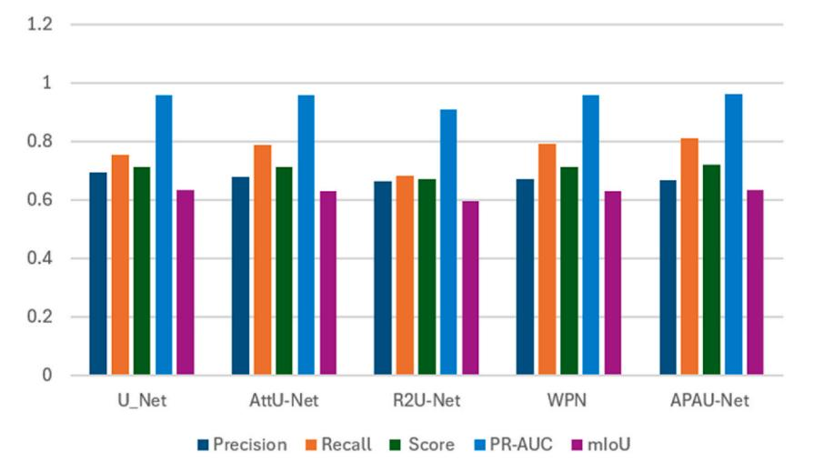

**Fig. 5.** Comparison of model performance across various metrics from enhanced datasets 64 × 64 resolution.

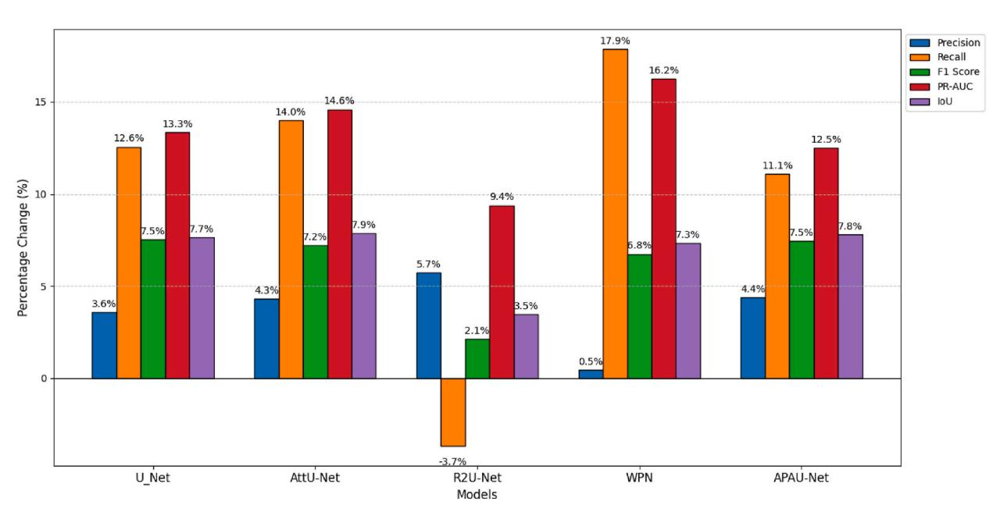

**Fig. 6.** Percentage improvement of models trained on the enhanced dataset compared to the original dataset at 64 × 64 resolution.

Table 5 illustrates the performance of segmentation models on the enhanced dataset with 64 × 64 resolution, highlighting the leading performance of APAU-Net. It achieved the highest F1 Score of 0.720, PR-AUC of 0.962, and IoU of 0.635, demonstrating its strong ability to segment wildfire spread accurately. While WPN achieved the highest Recall of 0.792, indicating strong sensitivity to wildfire regions, APAU-Net balanced Recall at 0.812 with Precision at 0.668, resulting in better overall performance. U-Net and AttU-Net exhibited comparable F1 Scores of 0.715 and 0.712, respectively, though APAU-Net demonstrates improved performance in

| Table 5                                                                    |
|----------------------------------------------------------------------------|
| Results for the models trained on the enhanced dataset 64 × 64 resolution. |

| Models   | Precision | Recall | F1 Score | PR-AUC | mIoU  |
|----------|-----------|--------|----------|--------|-------|
| U_Net    | 0.695     | 0.753  | 0.715    | 0.960  | 0.633 |
| AttU-Net | 0.678     | 0.790  | 0.712    | 0.958  | 0.631 |
| R2U-Net  | 0.664     | 0.684  | 0.670    | 0.909  | 0.597 |
| WPN      | 0.672     | 0.792  | 0.712    | 0.959  | 0.630 |
| APAU-Net | 0.668     | 0.812  | 0.720    | 0.962  | 0.635 |

critical metrics such as IoU and PR-AUC. The enhanced dataset significantly improved model performance compared to the original dataset across all metrics, particularly for APAU-Net. The IoU for APAU-Net increased from 0.589 to 0.635, and its F1 Score improved from 0.670 to 0.720, showcasing enhanced segmentation accuracy. PR-AUC also saw a notable increase from 0.855 to 0.962, highlighting better handling of imbalanced classes. Other models, such as U-Net and WPN, also demonstrated marked improvements in F1 Score and IoU with the enhanced dataset. These results confirm that the additional input features in the enhanced dataset allowed models to improve the predicted accuracy of wildfire spread, with APAU-Net achieving the best overall performance. Figs. 7 and 8 illustrate better and poor segmentation predictions using the APAU-Net on the 64 × 64 resolution.

The results in [Tables 6 and 7](#page-12-0) highlight the performance differences between models trained on the original and enhanced datasets for wildfire spread prediction. In [Table 6](#page-12-0), which shows results from the original 32 × 32 dataset, APAU-Net achieved the highest F1 Score of 0.665, slightly outperforming U-Net, which had an F1 Score of 0.663. While WPN exhibited the highest Recall of 0.729, it had a lower F1 Score of 0.656 due to its slightly lower precision. APAU-Net also achieved the highest PR-AUC of 0.854, indicating its strong ability to rank predictions effectively. In contrast, [Table 7](#page-12-0), which presents results from the enhanced dataset, shows a significant performance improvement across all models. APAU-Net again achieved the highest F1 Score of 0.689, closely followed by U-Net and AttU-Net, both at 0.687, reflecting the positive impact of additional features such as weather forecasts and terrain data. The enhanced dataset also led to better PR-AUC values, with U-Net achieving the highest at 0.891, followed closely by APAU-Net at 0.887. WPN had the highest Recall of 0.739, though its F1 Score of 0.683 was slightly lower due to precision trade-offs. These results demonstrate that the enhanced dataset, integrating relevant environmental factors, significantly boosts model performance. APAU-Net shows the best overall balance between precision and recall for predicting wildfire spread. [Fig. 9](#page-13-0) compares model performance across various metrics on the original 64 × 64 resolution datasets.

Training on the 64 × 64 resolution dataset improved performance across most models more than the 32 × 32 resolution. Higher resolution provided better spatial detail, enhancing recall, F1 Score, PR-AUC, and IoU. For instance, U-Net and APAU-Net showed significant gains in recall at 64 × 64 resolution, with 12.56 % and 11.08 % improvements, respectively, compared to only 1.26 % and 1.79 % at 32 × 32 resolution. Conversely, R2U-Net exhibited a sharp decline in recall at 64 × 64 resolution (− 3.66 %) compared to a slight increase at 32 × 32 resolution (1.39 %). The PR-AUC values were also consistently higher at 64 × 64 resolution, reinforcing that higher resolution improves predictive performance. These findings highlight the importance of spatial resolution in wildfire modeling, with lower resolutions limiting the model's ability to capture intricate patterns. The percentage improvements in the performance of models trained on the enhanced dataset compared to the original dataset at 32 × 32 resolution are presented in [Fig. 10](#page-13-0).

## *5.2. Computational efficiency analysis of the models*

In our experiments, we evaluated the computational performance of all segmentation models on the enhanced 64 × 64 dataset, as summarized in [Table 8.](#page-13-0) All models were trained for 15 epochs, ensuring a consistent training duration. The APAU-Net, having the largest number of parameters of 47.1M, achieved the highest best validation F1 Score of 0.721 after 13 epochs, indicating its ability to converge effectively despite its complexity. However, this performance came at the cost of a slightly longer training time of 41 min and 30 s compared to the other models. The WPN model, with only 8.7M parameters, demonstrated an excellent balance between computational efficiency and performance, achieving a validation F1 Score of 0.715 in 8 epochs with a training time of 35 min and 20 s. U-Net and AttU-Net, despite having similar parameter counts of 34.5M and 34.9M, respectively, achieved lower F1 Scores of 0.713

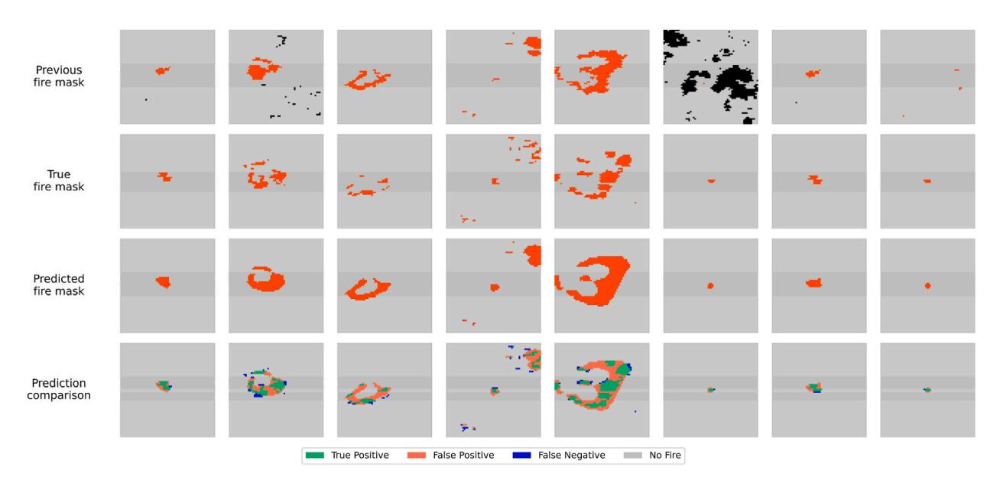

**Fig. 7.** Better prediction samples using APAU-Net.

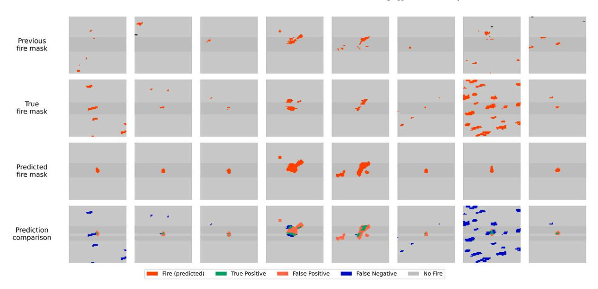

**Fig. 8.** Poor prediction samples using APAU-Net. Blue are areas where the model failed to predict correctly, while green are areas where the model predicted correctly.

Results for the models trained on the original 32 × 32 dataset.

| Models   | Precision | Recall | F1 Score | PR-AUC | mIoU  |
|----------|-----------|--------|----------|--------|-------|
| U_Net    | 0.636     | 0.717  | 0.663    | 0.844  | 0.582 |
| AttU-Net | 0.627     | 0.726  | 0.658    | 0.849  | 0.578 |
| R2U-Net  | 0.628     | 0.717  | 0.655    | 0.837  | 0.576 |
| WPN      | 0.624     | 0.729  | 0.656    | 0.852  | 0.576 |
| APAU-Net | 0.637     | 0.726  | 0.665    | 0.854  | 0.584 |

## **Table 7**

Results for the models trained on the enhanced 32 × 32 datasets.

| Models   | Precision | Recall | F1 Score | PR-AUC | mIoU  |
|----------|-----------|--------|----------|--------|-------|
| U_Net    | 0.662     | 0.726  | 0.687    | 0.891  | 0.603 |
| AttU-Net | 0.666     | 0.719  | 0.687    | 0.877  | 0.603 |
| R2U-Net  | 0.642     | 0.727  | 0.671    | 0.871  | 0.589 |
| WPN      | 0.661     | 0.717  | 0.683    | 0.876  | 0.600 |
| APAU-Net | 0.658     | 0.739  | 0.689    | 0.887  | 0.605 |

and 0.711, with the best epochs reached earlier at 6 and 9 epochs. The slightly longer training time of 39 min and 14 s for AttU-Net can be attributed to including attention mechanisms, which enhance feature selection but increase computational overhead. The R2U-Net model, with 39M parameters, took the longest training time of all models, requiring 1 h and 11 min to complete training. This model achieved the lowest validation F1 Score of 0.677. While the model benefited from residual connections, which help with the flow of information, it did not leverage the multi-scale feature extraction present in APAU-Net, which may have contributed to its lower performance compared to other models.

# *5.3. Feature analysis*

To analyze the effect of input features on prediction performance, we conducted ablation studies using APAU-Net, the bestperforming model with the enhanced 64 × 64 dataset. Instead of removing individual features, this study aimed to identify which categories were more useful by systematically removing the entire category of features while retaining the previous fire mask to evaluate their contribution to the model. By isolating the effects of weather variables, terrain features, and vegetation indices, the ablation results provide an understanding of feature importance, guiding future model enhancements. [Table 9](#page-14-0) highlights the contributions of each feature group to the model's performance when the previous fire mask was retained alongside one additional feature category. Weather data emerged as the most impactful feature, achieving an F1 Score of 0.640, PR-AUC of 0.890, and mIoU of 0.575.

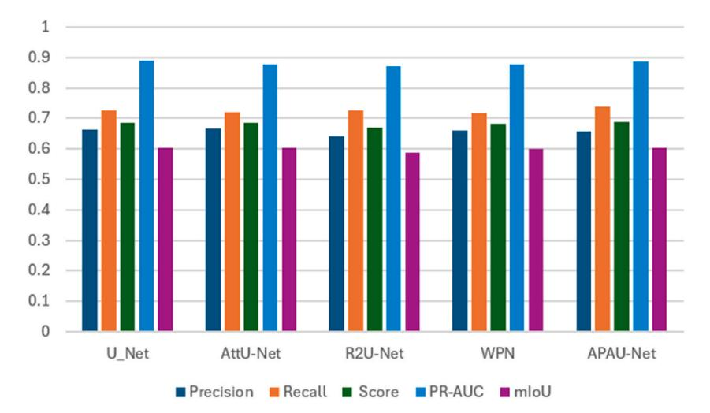

**Fig. 9.** Comparison of model performance across various metrics from original 64 × 64 resolution.

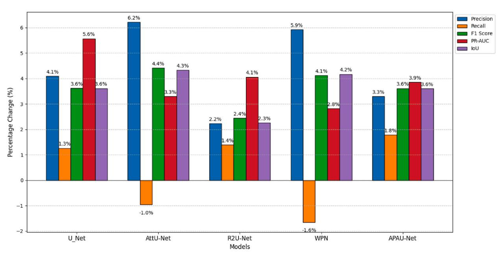

**Fig. 10.** Percentage improvement of models trained on the enhanced dataset compared to the original dataset at 32 × 32 resolution.

| Table 8                                                                  |
|--------------------------------------------------------------------------|
| Computational performance of all models on the enhanced 64 × 64 Dataset. |
|                                                                          |

| Models   | Parameters (Millions) | Max. epochs | Best epochs | Training time | Best Validation F1 Score |
|----------|-----------------------|-------------|-------------|---------------|--------------------------|
| U_Net    | 34.5M                 | 15          | 6           | 0:36:33       | 0.713                    |
| AttU-Net | 34.9M                 |             | 9           | 0:39:14       | 0.711                    |
| R2U-Net  | 39.0M                 |             | 5           | 1:11:32       | 0.677                    |
| WPN      | 8.7M                  |             | 8           | 0:35:20       | 0.715                    |
| APAU-Net | 47.1M                 |             | 13          | 0:41:30       | 0.721                    |

The F1 score of weather data was 0.31 % higher than that of topography, which had an F1 score of 0.638 and 0.7 % higher in mIoU, with 0.575 compared to 0.571 for vegetation. In contrast, population and weather forecasts yielded lower performance, with the population having an F1 Score of 0.630 and a mIoU of 0.569, representing a decrease of 1.56 % and 1.04 % compared to weather data. Weather forecasts achieved the highest mIoU of 0.579, which was 0.69 % higher than weather data, but had a lower F1 Score of 0.637. Vegetation achieved moderate performance, with an F1 Score of 0.634, 0.94 % lower than weather data, and a mIoU of 0.571, 0.7 %

| Feature ablation: keeping the previous fire mask and one of the categories as input. The best performance scores are highlighted in bold. |  |  |  |  |
|-------------------------------------------------------------------------------------------------------------------------------------------|--|--|--|--|
|-------------------------------------------------------------------------------------------------------------------------------------------|--|--|--|--|

| Category          | Precision | Recall | F1 Score | PR-AUC | mIoU  |
|-------------------|-----------|--------|----------|--------|-------|
| Topography        | 0.639     | 0.641  | 0.638    | 0.880  | 0.574 |
| Vegetation        | 0.630     | 0.641  | 0.634    | 0.881  | 0.571 |
| Weather           | 0.631     | 0.656  | 0.640    | 0.890  | 0.575 |
| Weather forecasts | 0.629     | 0.652  | 0.637    | 0.882  | 0.579 |
| Population        | 0.633     | 0.632  | 0.630    | 0.865  | 0.569 |

#### lower.

Table 10 illustrates the impact of retaining topography (which affects fire propagation, intensity, and rate of spread [\(Ning et al.,](#page-19-0) [2022\)](#page-19-0)) and the previous fire mask alongside a single additional category. Weather forecasts provided the best overall performance, achieving an F1 Score of 0.642 and a mIoU of 0.577, which were 0.31 % and 0.35 % higher than vegetation, the next best-performing category. The population performed slightly worse than weather forecasts, with an F1 Score of 0.637, 0.78 % lower, and a mIoU of 0.573, 0.69 % lower. Weather with an F1 Score of 0.640 and mIoU of 0.575 was also slightly outperformed by weather forecasts, with a difference of 0.31 % in F1 Score and 0.35 % in mIoU. Further analysis in [Table 11](#page-15-0) explored the impact of using only the previous fire mask. Using only the previous fire mask resulted in an F1 Score of 0.631 and a mIoU of 0.570. This represents a performance drop of 1.72 % in F1 Score and 1.22 % in mIoU compared to the best-performing setup that included weather forecasts. These findings indicate that while the previous fire mask is an important feature, it is insufficient and requires complementary data from other categories. The absence of weather forecasts still results in reduced model performance despite the inclusion of other features, confirming their critical importance. The study demonstrates that weather-related features, particularly observed weather and forecasts, are the most significant contributors to wildfire spread prediction accuracy. Topography and vegetation provide valuable spatial context but are less impactful than weather data. Population consistently showed limited contributions, suggesting its relative insignificance in improving model performance. The analysis highlights the importance of multimodal data integration, with a particular emphasis on weather-related variables and previous fire masks to enhance the accuracy of wildfire models. These findings suggest that incorporating comprehensive data sources from diverse feature categories is critical for addressing the complexity of wildfire dynamics and improving model reliability across diverse geographic and environmental contexts.

The bar chart in [Fig. 11](#page-15-0) illustrates the importance of the feature based on convolutional weights, revealing the most influential factors in predicting wildfire spread. The most important features include PrevFireMask, which emphasizes the significance of previous fire behavior, followed by fwd, slope, and fpr, highlighting the key roles of weather conditions and terrain in fire spread. EVI, tmnm, and erc also play significant roles, indicating the importance of fuel availability and environmental conditions. Other features, such as population, elevation, and NDVI, have lower importance, while fws and th are less influential, though they still contribute to the model. The model relies heavily on historical fire data, weather factors like wind and precipitation, and terrain characteristics, with secondary importance given to vegetation health and temperature. [Fig. 12](#page-16-0) displays feature attributes for predicting wildfire spread using IG. Each subplot corresponds to a specific input feature. The color intensity in each subplot indicates the importance of that feature in influencing the model's prediction, where brighter regions (yellow/green) represent higher attributions, meaning the feature strongly contributed to the prediction in those spatial areas. The ground truth fire mask at the end of the bottom row shows the actual wildfire regions (yellow areas). By comparing this with the attribution maps, we observe that features like PrevFireMask, fwd, and fpr exhibit bright regions that align closely with the ground truth mask, indicating these features are critical for predicting fire spread. In contrast, some features like pdsi and pr show minimal attributions, suggesting they had little influence on the prediction. Overall, the model relies on previous fire activity, topographic features (e.g., elevation, slope), and wind-related variables to make its predictions. The alignment between bright attribution regions and the ground truth fire mask highlights the spatial areas where these features played a significant role in detecting wildfire spread.

# **6. Discussion**

The APAU-Net demonstrates improved performance compared to the standard U-Net, Attention U-Net, and R2U-Net throughout our experiments. This improvement can be attributed to substituting the standard convolutional layers in the Attention U-Net with ASPC blocks. The results across both the enhanced and original datasets suggest that APAU-Net provides a more robust solution for capturing the complex dynamics of wildfire spread, particularly in the F1 scores, IoU, and AUC metrics, where it consistently outperformed other models. Using ASPC blocks enhanced the model's ability to capture multi-scale features, leading to better performance in predicting wildfire spread. Notably, while our results on the 32 × 32 resolution dataset were slightly lower than on the 64 ×

# **Table 10**

Feature ablation: keep Topography + previous fire mask and one other category. The best performance scores are highlighted in bold.

| Category          | Precision | Recall | F1 Score | PR-AUC | mIoU  |
|-------------------|-----------|--------|----------|--------|-------|
| Vegetation        | 0.644     | 0.641  | 0.641    | 0.892  | 0.577 |
| Weather           | 0.625     | 0.664  | 0.640    | 0.897  | 0.575 |
| Weather forecasts | 0.632     | 0.657  | 0.642    | 0.892  | 0.577 |
| Population        | 0.628     | 0.653  | 0.637    | 0.881  | 0.573 |

Results of the feature ablation study, comparing the performance of the model when trained with only the previous fire mask.

| Category                | Precision | Recall | F1 Score | PR-AUC | mIoU  |
|-------------------------|-----------|--------|----------|--------|-------|
| Previous fire mask only | 0.638     | 0.616  | 0.631    | 0.868  | 0.570 |

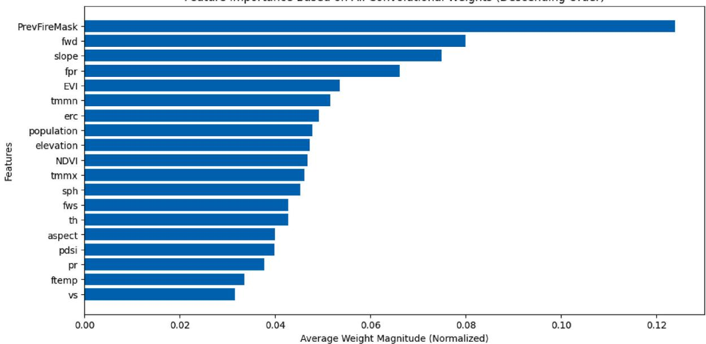

**Fig. 11.** Feature importance based on all convolutional weights, displayed in descending order.

64 resolution, APAU-Net still demonstrated its ability to adapt to different spatial resolutions, a crucial characteristic for wildfire prediction in diverse scenarios. The differences in performance across resolutions highlight the trade-offs involved when using finer vs. coarser grid resolutions. The 64 × 64 resolution provides a more detailed view, allowing the model to capture more granular spatial patterns. In comparison, the 32 × 32 resolution is more computationally efficient but slightly loses accuracy. This indicates that resolution choice is critical in balancing model performance and computational cost. Although effective in segmentation tasks, the standard U-Net struggles with capturing contextual information from multiple scales simultaneously. While Attention U-Net incorporates attention units to focus on important features, it does not fully leverage the multi-scale representation capabilities of ASPC blocks. Similarly, the R2U-Net, which introduces residual connections to enhance information flow, also benefits from improved learning, but it still lacks the robust multi-scale feature extraction offered by ASPC blocks. In contrast, APAU-Net integrates multi-scale information and attention units, making it more effective in identifying complex patterns in the spread of wildfire. The paired t-tests on the IoU metric did not show consistent improvements over all baseline models. This suggests that while APAU-Net demonstrates strong overall performance, further enhancement may be required to achieve statistically significant gains in spatial overlap across all comparisons.

This study aimed to enhance the accuracy of predictions by improving the dataset's quality and refining the model architecture. The primary focus of our work was to enhance the existing dataset by incorporating additional weather forecasts and terrain features, which are known to affect the spread of fire according to physical laws ([Vogiatzoglou et al., 2025](#page-19-0)). Although ([Li and Rad, 2024](#page-19-0)) extended the dataset to cover the entire North American continent, the results did not improve. Their study evaluated performance using different models for both datasets, achieving an F1 Score of 0.4066 on the extended dataset, which was lower than the F1 Score of 0.4132 obtained from the original dataset. This suggests that extending the dataset, even across a larger geographical area and a longer time span, does not necessarily lead to a substantial improvement in prediction accuracy. In contrast, the present study enhanced the dataset and performed better. Our experiments on the enhanced dataset achieved an F1 Score of 0.720 and a mIoU of 0.635 at a resolution of 64 × 64 pixels, along with an F1 Score of 0.689 and mIoU of 0.605 at 32 × 32 resolution. These results substantially improve over those reported in previous studies using the original NDWS dataset. We conducted experiments using the original NDWS dataset with our custom loss function; we achieved F1 Scores of 0.670 and mIoU of 0.589 at 64 × 64 resolution and F1 Scores of 0.665 and mIoU of 0.584 at 32 × 32 resolution. These figures already surpass the performance metrics reported in earlier works, such as [\(Huot et al., 2022\)](#page-19-0), which achieved an AUC of only 0.284, and [\(Xiao et al., 2024\)](#page-19-0), which reported an F1 Score of 0.405 using U2-NET. Furthermore [\(Fitzgerald et al., 2023](#page-19-0)), reported F1 Scores of 0.370 at 32 × 32 resolution and 0.401 at 64 × 64 resolution, further emphasizing the limited improvements observed from using the original dataset. These findings further support that increasing the

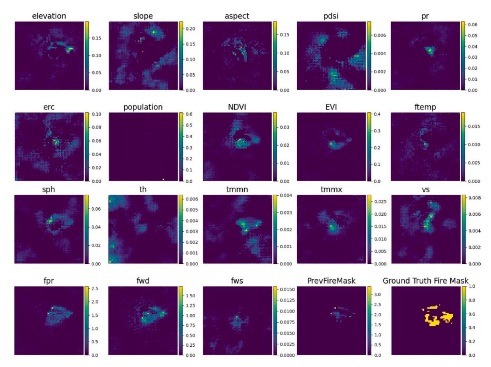

**Fig. 12.** Integrated gradient attributions for a single sample from the test dataset, showing the contribution of each input feature in the model's prediction. The Ground Truth Fire Mask is included for comparison.

dataset size does not necessarily improve model performance. However, with additional forecast data and terrain features in our enhanced dataset, we significantly improved the F1 score, mIoU, and AUC. Since this study aims to predict the next-day wildfire spread, the forecast weather data likely plays a crucial role in capturing the dynamic weather conditions, which can significantly influence fire behavior. This suggests that the quality and relevance of the data, rather than its size alone, is crucial in enhancing the accuracy of wildfire spread. Moreover, these results highlight that advancements in wildfire prediction are not solely dependent on increasingly complex architecture but also hinge on addressing methodological limitations such as choosing a custom loss function and using a comprehensive evaluation metric.

The feature importance and ablation study reveal critical understandings of the contributions of individual features to wildfire spread. As shown in [Fig. 11,](#page-15-0) the previous fire mask emerged as the most influential feature, emphasizing its crucial role in maintaining temporal continuity and tracking fire dynamics. Through IG analysis, our model demonstrates practical strengths in explainability, as shown in Fig. 12, which highlights feature attributions and their spatial contributions. This helps interpret model decisions and identify the factors that most influence wildfire spread. In the ablation study, when the model was trained using only the previous fire mask, it yielded promising results, as indicated in [Table 11,](#page-15-0) with a mIoU of 0.570, AUC of 0.868, and an F1 score of 0.631. This aligns with the findings of [\(Fitzgerald et al., 2023\)](#page-19-0), where the previous fire mask was identified as the most significant factor influencing the model's predictions. For example [\(Jain et al., 2020\)](#page-19-0), reported an F1 Score of 0.361 when relying solely on the previous fire mask, and [\(Huot et al., 2022\)](#page-19-0) achieved a recall of 0.496. While our model demonstrates an improved performance in this context, this improvement can be attributed to utilizing our enriched dataset and implementing our custom loss function. Despite the promising results achieved by using only the previous fire mask, there are inherent limitations to relying solely on this feature for achieving better prediction accuracy. In contrast, when all features are included, our model demonstrates improved performance, leveraging the predictive power of additional features and the predictive capabilities of our model. Based on the feature ablation experiments conducted in [\(Huot et al., 2022\)](#page-19-0) and ([Fitzgerald et al., 2023](#page-19-0)) elevation and vegetation features perform effectively when combined with the previous fire mask. Motivated by these findings, we incorporated these features in our experiments, which are reported in [Table 10](#page-14-0). Our results align with and validate the observations made in the original study. Weather-related variables, particularly forecast wind speed (fwd) and forecast precipitation (fpr), among the input features, were identified as highly significant. These findings highlight the direct impact of weather on wildfire behavior. Weather forecasts, especially those related to wind and precipitation, have a more immediate and dynamic effect on wildfire spread than more static features like population density or vegetation indices. Forecast wind speed, for instance, directly influences how quickly a fire spreads and in which direction. These findings align with the ablation results, demonstrating that weather forecasts consistently improved F1 Scores and IoU metrics. Topography, represented by slope, also ranked highly, emphasizing its importance in capturing spatial patterns of fire propagation [\(Li et al., 2025b](#page-19-0)). Conversely, features like population density and ERC exhibited lower importance, suggesting that their contributions are less direct and context-dependent. Population density, while useful for assessing the impact of wildfire on human populations, does not directly influence the real-time spread of fire. Similarly, while vegetation indices (EVI and NDVI) provide moderate predictive power, reflecting their role in estimating fuel availability [\(Sayad et al., 2019\)](#page-19-0), they do not have the same immediate impact on fire dynamics as weather forecasts. The inclusion of weather forecasts and terrain features enhances the model's ability to anticipate real-time fire behavior, addressing a critical limitation of previous studies that relied solely on historical data.

This study demonstrates a significant contribution to training efficiency compared to previous work. [Fitzgerald et al. \(2023\)](#page-19-0) achieved good performance after training for 10–20 epochs on a GTX 1060 GPU with 6 GB of VRAM, using between 4 and 8 machines in parallel. Despite their use of multiple machines, their model achieved a training time of 2 min per epoch using 18,545 samples from the original NDWS dataset. On the other hand [\(Huot et al., 2022\)](#page-19-0), trained their model for 1000 epochs with 1000 iterations per epoch, utilizing 4 V100 GPUs, resulting in a considerable computational burden and significantly higher resource usage. To provide a fair comparison, we trained APAU-Net using the original NDWS dataset for 15 epochs on a GeForce RTX 3090 Ti GPU; APAU-Net achieved a training time of 1 min and 27 s per epoch, significantly faster than both ([Huot et al., 2022](#page-19-0)) and ([Fitzgerald et al., 2023\)](#page-19-0). Moreover, when using our enhanced dataset with 39,333 samples, APAU-Net maintained a training time of just 2 min and 56 s per epoch, demonstrating both scalability and efficiency. This reduction in training time and hardware dependency highlights APAU-Net's practical advantages for real-world deployment, especially in resource-constrained environments. APAU-Net's efficiency is further complemented by its architectural innovations. The integration of ASPC blocks enables multi-scale feature extraction, while convolutional attention mechanisms enhance the model's ability to focus on critical wildfire-related regions. Together, these components not only improve segmentation accuracy but also do so with lower computational overhead. As a result, APAU-Net delivers high performance with reduced training costs, making it a viable solution for time-sensitive wildfire prediction and emergency response operations.

Despite the advancements achieved in this study, several limitations should be acknowledged. Although enriched with forecast variables and terrain features, the enhanced dataset remains region-specific. It may have limited generalizability to other geographic areas, which introduces some uncertainty in its applicability to regions with different environmental conditions. The reliance on weather forecast data may introduce potential errors from inaccuracies in meteorological predictions, which could introduce potential vulnerabilities to input uncertainties, which were not quantified in this study. APAU-Net model was validated exclusively on the contiguous U.S., leaving its generalization to geographically distinct fire regimes (e.g., Australian bushfires, Mediterranean ecosystems) untested. Although the weighted loss function was applied to address class imbalance, techniques such as stratified sampling or advanced data augmentation were not explored, leaving room for further optimization in handling skewed datasets. Additionally, while the APAU-Net demonstrated improved performance, its computational complexity could pose challenges for deployment in realtime wildfire management systems, especially in resource-constrained environments where processing power and speed are critical. Operational validation in real-time wildfire scenarios remains unexplored, leaving its practical utility for decision support unverified. Another limitation lies in the spatial resolution of the historical fire at 1 km used in this study. While this resolution is sufficient for large-scale predictions, it may not capture finer wildfire dynamics, leading to potential uncertainties in understanding the detailed behavior of fire spread at smaller scales. Enhancing spatial resolution would allow for a more detailed understanding of fire spread patterns and behavior, helping to reduce some of the uncertainties that come with broader-scale predictions. Additionally, this study concentrated on predicting fire spread for the next day only rather than offering extended forecasts spanning several days.

Future research should aim to extend the dataset's geographic coverage to include diverse regions and fire regimes, enhancing the model's generalizability. Improving spatial resolution from 1 km to 375 m by utilizing VIIRS S-NPP could significantly enhance the granularity of predictions, capturing finer-scale fire dynamics. Incorporating additional data sources, such as LANDFIRE, which provides 40 fire behavior fuel models (FBFM40) at a native 30m resolution, along with real-time satellite imagery and atmospheric conditions, could significantly enhance the accuracy of wildfire spread predictions by providing more detailed fuel, land, and environmental information. Additionally, predicting wildfire spread over several days, rather than just the next day, would be valuable for long-term planning and mitigation strategies. Further validation on APAU-Net across international wildfire datasets to assess geographic generalization. Integrating uncertainty-aware training to improve robustness to weather forecast errors, while testing the model in near-real-time operational environments would assess its practical applicability. Additionally, refining class imbalance mitigation through stratified sampling and hybrid loss functions may also improve model performance. Lastly, explainability methods, such as Grad-CAM, could provide a deeper understanding of the model's decision-making process, aiding trust and adoption by wildfire management agencies.

### **7. Conclusions**

This study addresses key challenges in predicting wildfire spread by enhancing the NDWS dataset and developing an advanced DL model. By modifying the dataset's temporal coverage and integrating additional features such as weather forecasts and terrain attributes, we created a more comprehensive resource for wildfire modeling. The APAU-Net, featuring ASPC blocks and attention

mechanisms, demonstrated its ability to capture spatial and temporal dependencies critical for accurate predictions effectively. Our experiments revealed that APAU-Net demonstrates improved performance compared to existing methods in next-day wildfire spread prediction, achieving higher F1 Scores, IoU, and PR-AUC across various feature combinations. However, the lack of consistent statistical significance in IoU suggests that further refinement. Ablation studies highlight the importance of specific input feature categories, providing an understanding of their contributions to prediction accuracy. Moreover, the model achieved this performance with considerably reduced training times, highlighting its computational efficiency. By incorporating IG, we ensured that our model is not only accurate but also interpretable. This transparency allows stakeholders to understand which features are most influential in predicting wildfire spread, facilitating more effective decision-making in wildfire management. These findings demonstrate that combining an enriched dataset with a carefully designed DL model can significantly improve wildfire spread prediction. This study contributes to advancing wildfire management tools, with potential applications in early warning systems and resource allocation. Future research could explore extending the dataset to diverse regions, incorporating additional data features, and optimizing the model for real-time predictions to enhance its practical impact further.

## **CRediT authorship contribution statement**

**Rufai Yusuf Zakari:** Writing – original draft, Software, Methodology, Data curation. **Owais Ahmed Malik:** Writing – review & editing, Supervision, Methodology, Conceptualization. **Ong Wee-Hong:** Supervision, Conceptualization.

## **Ethical statement**

We declare that all ethical practices have been followed in relation to the development, writing, and publication of the article.

- 1) This material is the authors' own original work, which has not been previously published elsewhere.
- 2) The paper is not currently being considered for publication elsewhere.
- 3) The paper reflects the authors' own research and analysis in a truthful and complete manner.
- 4) The paper properly credits the meaningful contributions of co-authors and co-researchers.
- 5) The results are appropriately placed in the context of prior and existing research.
- 6) All sources used are properly disclosed (correct citation). Literally copying of text must be indicated as such by using quotation marks and giving proper references.
- 7) All authors have been personally and actively involved in substantial work leading to the paper and will take public responsibility for its content.

#### **Declaration of competing interest**

The authors declare that they have no known competing financial interests or personal relationships that could have appeared to influence the work reported in this paper.

Funding

This work was supported by Universiti Brunei Darussalam under research grant number UBD/ RSCH/1.18/FICBF(a)/2022/006.

# **Data availability**

The most current information regarding the dataset and the code utilized in this study is available at [https://github.com/ry-zakari/](https://github.com/ry-zakari/Wildfire-Spread-Prediction) [Wildfire-Spread-Prediction](https://github.com/ry-zakari/Wildfire-Spread-Prediction).

## **References**

- Abatzoglou, J.T., 2013. Development of gridded surface meteorological data for ecological applications and modelling. Int. J. Climatol. 33 (1). [https://doi.org/](https://doi.org/10.1002/joc.3413) [10.1002/joc.3413.](https://doi.org/10.1002/joc.3413)
- Ali, S.H., Goel, A., Singirikonda, A., Khan, A.Y., Xiao, T., 2022. Towards a comprehensive dataset for next-day wildfire prediction. In: Proceedings 2022 IEEE 22nd International Conference on Software Quality, Reliability and Security Companion, QRS-C 2022. Institute of Electrical and Electronics Engineers Inc., pp. 593–598. <https://doi.org/10.1109/QRS-C57518.2022.00095>
- Allaire, F., Mallet, V., Filippi, J.B., 2021. Emulation of wildland fire spread simulation using deep learning. Neural Netw. 141. [https://doi.org/10.1016/j.](https://doi.org/10.1016/j.neunet.2021.04.006)  [neunet.2021.04.006.](https://doi.org/10.1016/j.neunet.2021.04.006)
- Alom, M.Z., Yakopcic, C., Hasan, M., Taha, T.M., Asari, V.K., 2019. Recurrent residual U-Net for medical image segmentation. J. Med. Imaging 6 (1). [https://doi.org/](https://doi.org/10.1117/1.jmi.6.1.014006) [10.1117/1.jmi.6.1.014006](https://doi.org/10.1117/1.jmi.6.1.014006).
- Andrianarivony, H.S., Akhloufi, M.A., 2024. Machine Learning and Deep Learning for Wildfire Spread Prediction: A Review. Multidisciplinary Digital Publishing Institute (MDPI). [https://doi.org/10.3390/fire7120482.](https://doi.org/10.3390/fire7120482)
- Beyki, S.M., Manuel, A., Lopes, G., Santiago, A., Laím, L.. Wildfire simulation using satellite active fire data interval reinitialization and rate of spread adjustment [Online]. Available: [https://ssrn.com/abstract](https://ssrn.com/abstract=5041284)=5041284.

Bolt, A., Dabrowski, J.J., Huston, C., Kuhnert, P., 2022. An emulation framework for fire front spread [Online]. Available: <http://arxiv.org/abs/2203.12160>. [Bradshaw, L.S., Deeming, J.E., Burgan, R.E., Cohen, J.D., 1983. The 1978 national fire-danger rating system: technical documentation. USDA Forest Serv Gen Tech](http://refhub.elsevier.com/S2352-9385(25)00185-5/sref8)

[Rep INT- 169 \(July\)](http://refhub.elsevier.com/S2352-9385(25)00185-5/sref8). J. Burge, M. Bonanni, M. Ihme, and R. L. Hu, "Convolutional LSTM Neural Networks for Modeling Wildland Fire Dynamics Running Head: ConvLSTMs for Wildland Fire Dynamics.".

- Chen, L.C., Papandreou, G., Kokkinos, I., Murphy, K., Yuille, A.L., 2018. DeepLab: semantic image segmentation with deep convolutional nets, atrous convolution, and fully connected CRFs. IEEE Trans. Pattern Anal. Mach. Intell. 40 (4). <https://doi.org/10.1109/TPAMI.2017.2699184>.
- Chen, X., Tian, Y., Zheng, C., Liu, X., 2024. AutoST-Net: a spatiotemporal feature-driven approach for accurate forest fire spread prediction from remote sensing data. Forests 15 (4).<https://doi.org/10.3390/f15040705>.
- Fang, L., Yang, J., White, M., Liu, Z., 2018. Predicting potential fire severity using vegetation, topography and surface moisture availability in a Eurasian boreal forest landscape. Forests 9 (3). [https://doi.org/10.3390/f9030130.](https://doi.org/10.3390/f9030130)

Farr, T.G., et al., 2007. The shuttle radar topography mission. Rev. Geophys. 45 (2). <https://doi.org/10.1029/2005RG000183>.

Fitzgerald, J., Seefried, E., Yost, J.E., Pallickara, S., Blanchard, N., 2023. Paying attention to wildfire: using U-net with attention blocks on multimodal data for next day prediction. In: ACM International Conference Proceeding Series. <https://doi.org/10.1145/3577190.3614116>.

S. Gerard, Y. Zhao, and J. Sullivan, "WildfireSpreadTS: A Dataset of Multi-Modal Time Series for Wildfire Spread Prediction.".

- [Giglio, L., 2015. MOD14A1 MODIS/Terra thermal anomalies/fire daily L3 global 1 km SIN grid V006. NASA EOSDIS Land Proc DAAC 10.](http://refhub.elsevier.com/S2352-9385(25)00185-5/sref16)
- Grasso, P., Innocente, M.S., 2020. Physics-based model of wildfire propagation towards faster-than-real-time simulations. Comput. Math. Appl. 80 (5). [https://doi.](https://doi.org/10.1016/j.camwa.2020.05.009) [org/10.1016/j.camwa.2020.05.009](https://doi.org/10.1016/j.camwa.2020.05.009).
- Hodges, J.L., Lattimer, B.Y., 2019. Wildland fire spread modeling using convolutional neural networks. Fire Technol. 55 (6). [https://doi.org/10.1007/s10694-019-](https://doi.org/10.1007/s10694-019-00846-4) [00846-4.](https://doi.org/10.1007/s10694-019-00846-4)
- Huot, F., Hu, R.L., Goyal, N., Sankar, T., Ihme, M., Chen, Y.F., 2022. Next day wildfire spread: a machine learning dataset to predict wildfire spreading from remotesensing data. IEEE Trans. Geosci. Rem. Sens. 60. <https://doi.org/10.1109/TGRS.2022.3192974>.
- Jain, P., Coogan, S.C.P., Subramanian, S.G., Crowley, M., Taylor, S., Flannigan, M.D., 2020. A Review of Machine Learning Applications in Wildfire Science and Management. [https://doi.org/10.1139/er-2020-0019.](https://doi.org/10.1139/er-2020-0019)
- Jones, M.W., et al., 2022. Global and Regional Trends and Drivers of Fire under Climate Change. <https://doi.org/10.1029/2020RG000726>.
- Kale, M.P., Mishra, A., Pardeshi, S., Ghosh, S., Pai, D.S., Roy, P.S., 2022. Forecasting wildfires in major forest types of India. Front Forest Glob Change 5. [https://doi.](https://doi.org/10.3389/ffgc.2022.882685) [org/10.3389/ffgc.2022.882685.](https://doi.org/10.3389/ffgc.2022.882685)
- Kanwal, R., Rafaqat, W., Iqbal, M., Weiguo, S., 2023. Data-driven approaches for wildfire mapping and prediction assessment using a convolutional neural network (CNN). Remote Sens (Basel) 15 (21). <https://doi.org/10.3390/rs15215099>.
- Li, B.S., Rad, R., 2024. Wildfire spread prediction in North America using satellite imagery and vision transformer. In: Proceedings 2024 IEEE Conference on Artificial Intelligence, CAI 2024. Institute of Electrical and Electronics Engineers Inc., pp. 1536–1541. <https://doi.org/10.1109/CAI59869.2024.00278>
- Li, J., Zheng, K., Yao, J., Gao, L., Hong, D., 2022. Deep unsupervised blind hyperspectral and multispectral data fusion. Geosci. Rem. Sens. Lett. IEEE 19. [https://doi.](https://doi.org/10.1109/LGRS.2022.3151779) [org/10.1109/LGRS.2022.3151779](https://doi.org/10.1109/LGRS.2022.3151779).
- Li, J., Zheng, K., Liu, W., Li, Z., Yu, H., Ni, L., 2023a. Model-guided coarse-to-fine fusion network for unsupervised hyperspectral image super-resolution. Geosci. Rem. Sens. Lett. IEEE 20. [https://doi.org/10.1109/LGRS.2023.3309854.](https://doi.org/10.1109/LGRS.2023.3309854)
- Li, J., Zheng, K., Li, Z., Gao, L., Jia, X., 2023b. X-shaped interactive autoencoders with cross-modality mutual learning for unsupervised hyperspectral image superresolution. IEEE Trans. Geosci. Rem. Sens. 61. <https://doi.org/10.1109/TGRS.2023.3300043>.
- Li, J., Zheng, K., Gao, L., Ni, L., Huang, M., Chanussot, J., 2024. Model-Informed multistage unsupervised network for hyperspectral image super-resolution. IEEE Trans. Geosci. Rem. Sens. 62. [https://doi.org/10.1109/TGRS.2024.3391014.](https://doi.org/10.1109/TGRS.2024.3391014)
- Li, J., Zheng, K., Gao, L., Han, Z., Li, Z., Chanussot, J., 2025a. Enhanced deep image prior for unsupervised hyperspectral image super-resolution. IEEE Trans. Geosci. Rem. Sens. [https://doi.org/10.1109/TGRS.2025.3531646.](https://doi.org/10.1109/TGRS.2025.3531646)
- Li, S., Baijnath-Rodino, J.A., York, R.A., Quinn-Davidson, L.N., Banerjee, T., 2025b. Temporal and spatial pattern analysis of escaped prescribed fires in California from 1991 to 2020. Fire Ecol. 21 (1). <https://doi.org/10.1186/s42408-024-00342-3>.
- Liu, H., et al., 2025. Symmetric Bi-branch modality-search aggregation network for multi-modal liver segmentation. ICASSP 2025 2025 IEEE International Conference on Acoustics, Speech and Signal Processing (ICASSP), pp. 1–5. [https://doi.org/10.1109/ICASSP49660.2025.10888671.](https://doi.org/10.1109/ICASSP49660.2025.10888671)
- Marjani, M., Mesgari, M.S., 2023. The large-scale wildfire spread prediction using a multi-kernel convolutional neural network. In: ISPRS Annals of the Photogrammetry, Remote Sensing and Spatial Information Sciences. [https://doi.org/10.5194/isprs-annals-X-4-W1-2022-483-2023.](https://doi.org/10.5194/isprs-annals-X-4-W1-2022-483-2023)

[Michaels, J., 2024. Catching Fire: Predicting Wildfire Progress with Computer Vision](http://refhub.elsevier.com/S2352-9385(25)00185-5/sref33).

- Ning, J., et al., 2022. Effect of fire spread, flame characteristic, fire intensity on particulate matter 2.5 released from surface fuel combustion of Pinus koraiensis plantation– A laboratory simulation study. Environ. Int. 166. [https://doi.org/10.1016/j.envint.2022.107352.](https://doi.org/10.1016/j.envint.2022.107352)
- Oktay, O., et al., 2018. Attention U-net: learning where to look for the pancreas [Online]. Available:<http://arxiv.org/abs/1804.03999>.
- O'Mara, T., Meador, A.S., Colavito, M., Waltz, A., Barton, E., 2024. Navigating the Evolving Landscape of Wildfire Management: A Systematic Review of Decision Support Tools. Elsevier B.V.<https://doi.org/10.1016/j.tfp.2024.100575>

[Paszke, A., et al., 2019. PyTorch: an imperative style, high-performance deep learning library. In: Advances in Neural Information Processing Systems.](http://refhub.elsevier.com/S2352-9385(25)00185-5/sref37)

- Radke, D., Hessler, A., Ellsworth, D., 2019. Firecast: leveraging deep learning to predict wildfire spread. In: IJCAI International Joint Conference on Artificial Intelligence. <https://doi.org/10.24963/ijcai.2019/636>.
- Ronneberger, O., Fischer, P., Brox, T., 2015. U-net: convolutional networks for biomedical image segmentation. In: Lecture Notes in Computer Science (Including Subseries Lecture Notes in Artificial Intelligence and Lecture Notes in Bioinformatics). [https://doi.org/10.1007/978-3-319-24574-4\\_28.](https://doi.org/10.1007/978-3-319-24574-4_28)
- Sayad, Y.O., Mousannif, H., Al Moatassime, H., 2019. Predictive modeling of wildfires: a new dataset and machine learning approach. Fire Saf. J. 104. [https://doi.org/](https://doi.org/10.1016/j.firesaf.2019.01.006) [10.1016/j.firesaf.2019.01.006](https://doi.org/10.1016/j.firesaf.2019.01.006).
- Shadrin, D., et al., 2024. Wildfire spreading prediction using multimodal data and deep neural network approach. Sci. Rep. 14 (1). [https://doi.org/10.1038/s41598-](https://doi.org/10.1038/s41598-024-52821-x) [024-52821-x](https://doi.org/10.1038/s41598-024-52821-x).
- Shah, K., Pantoja, M., 2023. Wildfire spread prediction using attention mechanisms in U-NET. In: International Conference on Electrical, Computer, Communications and Mechatronics Engineering, ICECCME 2023. <https://doi.org/10.1109/ICECCME57830.2023.10252734>.
- Sharma, S.K., Aryal, J., Shao, Q., Rajabifard, A., 2023. Characterizing topographic influences of bushfire severity using machine learning models: a case study in a hilly terrain of victoria, Australia. IEEE J. Sel. Top. Appl. Earth Obs. Rem. Sens. 16.<https://doi.org/10.1109/JSTARS.2023.3249643>.
- Singh, A., Yadav, R., Sudhamshu, G., Basnet, A., Ali, R., 2023. Wildfire spread prediction using machine learning algorithms. In: 2023 14th International Conference on Computing Communication and Networking Technologies, ICCCNT 2023. [https://doi.org/10.1109/ICCCNT56998.2023.10308041.](https://doi.org/10.1109/ICCCNT56998.2023.10308041)
- Smith, J.T., et al., 2023. Where there's smoke, there's fuel: dynamic vegetation data improve predictions of wildfire hazard in the great basin. Rangel. Ecol. Manag. 89. [https://doi.org/10.1016/j.rama.2022.07.005.](https://doi.org/10.1016/j.rama.2022.07.005)

[Sundararajan, M., Taly, A., Yan, Q., 2017. Axiomatic attribution for deep networks. In: 34th International Conference on Machine Learning, ICML, 2017.](http://refhub.elsevier.com/S2352-9385(25)00185-5/sref46)

- [Vogiatzoglou, K., Papadimitriou, C., Bontozoglou, V., Ampountolas, K., 2025. Physics-informed neural networks for parameter learning of wildfire spreading. Comput.](http://refhub.elsevier.com/S2352-9385(25)00185-5/sref47) [Methods Appl. Mech. Eng. 434, 117545.](http://refhub.elsevier.com/S2352-9385(25)00185-5/sref47)
- Xiao, H., Zhu, Y., Sun, Y., Zhang, G., Gong, Z., 2024. Wildfire spread prediction using attention mechanisms in U2-NET. Forests 15 (10), 1711. [https://doi.org/](https://doi.org/10.3390/f15101711) [10.3390/f15101711](https://doi.org/10.3390/f15101711).
- Zhou, Y., Kong, R., Xu, Z., Xu, L., Cheng, S., 2025. Comparative and Interpretative Analysis of CNN and Transformer Models in Predicting Wildfire Spread Using Remote Sensing Data. [https://doi.org/10.1029/2024JH000409.](https://doi.org/10.1029/2024JH000409)